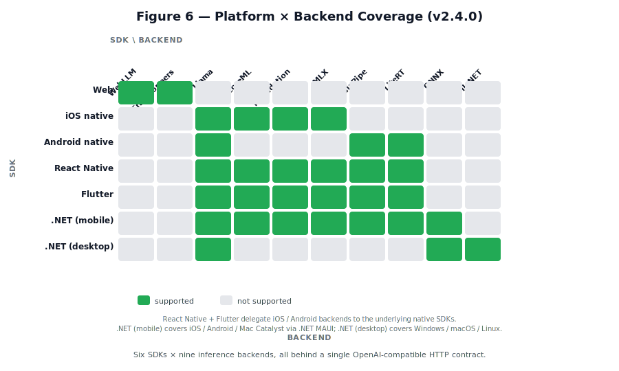
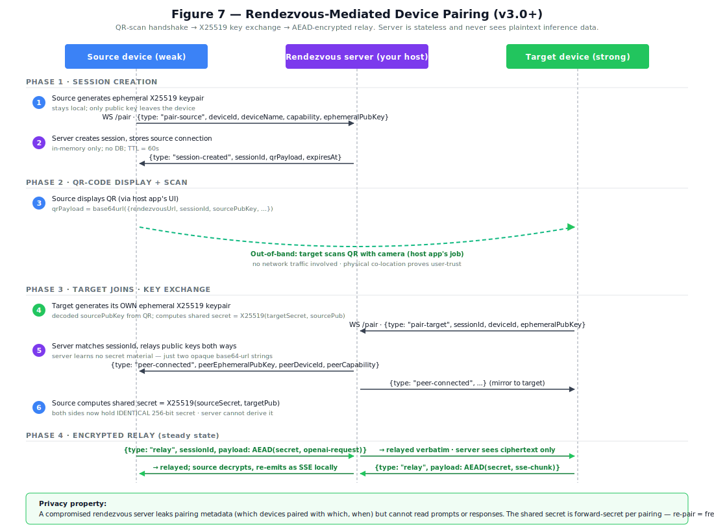

# DVAI-BRIDGE: A Universal Local-Inference Substrate for Agentic AI on the Client

**Author:** Deep Chakraborty, CTO, Deep Voice AI Limited
**Affiliation:** Deep Voice AI Limited, 71–75 Shelton Street, Covent Garden, London, WC2H 9JQ, United Kingdom
**Correspondence:** Deep Voice AI Limited
**Date:** May 2026
**Keywords:** edge AI, local inference, distributed inference, device offload, OpenAI API, mDNS, agentic AI, on-device LLM, privacy-preserving ML, WebGPU, llama.cpp, mobile inference

---

## Abstract

The dominant deployment model for large language models places inference inside centralized cloud services. For agentic workloads — where a single user request fans out into tens or hundreds of model calls — this architecture creates compounding problems across privacy, cost, latency, and vendor lock-in. We present **DVAI-BRIDGE**, a library that addresses three specific gaps that have kept local-AI deployment from competing with cloud APIs: (1) the *shipping gap* — local inference engines exist but require fragile per-platform integration that defeats application developers; (2) the *language-ecosystem gap* — those engines speak heterogeneous APIs with no shared contract across the JavaScript / Swift / Kotlin / Dart / C# stacks application code is written in; and (3) the *single-device gap* — local inference still assumes a single endpoint, ignoring the fact that users own a fleet of devices with widely varying capability. The library responds with three coordinated contributions: (a) a *pluggable backend matrix* that unifies nine inference engines behind a single TypeScript surface; (b) a *cross-platform OpenAI HTTP shim*, transported by Mock Service Worker in browsers and a real loopback server everywhere else, that gives every major client-development language the same drop-in OpenAI contract through seven SDKs; (c) a *distributed-inference layer* (v3.0+) that lets a weak device transparently offload to a stronger device the same user owns, via mDNS on the LAN or via a self-hostable rendezvous server over the internet, with the offload decision invisible to the agent code that consumes the endpoint. We describe the architecture, the gaps each contribution closes, the streaming + robustness machinery, the privacy properties of the offload path, integration case studies across all seven SDKs, and a forward vision in which local inference treats the user's devices as a small cluster rather than a single endpoint.

---

## 1. Introduction

The conventional wisdom for shipping LLM features in 2024–2026 has been "call the cloud." This works well for isolated, stateless prompts, but it frays quickly under three pressures that define agentic enterprise AI:

1. **Privacy and compliance.** Agent workflows tend to pull in the most sensitive context available — user files, meeting transcripts, patient records, internal code. Shipping that context to a third-party endpoint materially expands the data-protection surface that a CISO has to defend. Regulations such as the EU General Data Protection Regulation (GDPR), the Health Insurance Portability and Accountability Act (HIPAA), and the EU AI Act explicitly favour data minimisation and on-device processing where feasible.
2. **Cost.** A single user goal in an agent system typically expands into a tree of model calls (plan, tool-select, observe, reflect, retry, summarise). Each interior node is a billable token round-trip. The economics that make cloud LLMs attractive for a chat UI invert when a bot can spend ten dollars per successful task.
3. **Latency and reliability.** Agent loops are latency-multiplicative: every cloud round-trip is paid N times. Cloud outages compound the same way.

Two further pressures are under-discussed:

4. **Vendor lock-in.** Building on a proprietary API creates a hard dependency on a single vendor's roadmap, pricing, and content policy.
5. **Model over-specification.** A 175B+ generalist model is expensive overkill for narrow enterprise tasks that a 1B–3B specialist can solve. The right architecture is a *pipeline of small specialists*, not a monolithic oracle.

At the same time, three tailwinds now make client-side inference feasible in a way it was not two years ago. **Hardware:** WebGPU has shipped in every major browser; Apple Neural Engine, Qualcomm Hexagon, Intel NPU, and AMD XDNA appear in virtually every new consumer device. **Models:** small specialists such as Llama 3.2 1B, Gemma 2B, and Phi-3-mini approach the 2023-era quality of GPT-3.5 while fitting comfortably in 1–3 GB of VRAM after 4-bit quantisation. **Tooling:** WebLLM, Transformers.js, llama.cpp, MediaPipe LLM Inference, LiteRT, ONNX Runtime GenAI, ML.NET, and Apple's Foundation Models / CoreML / MLX each expose production-grade on-device inference. But each is an island. Each speaks its own API. Each ships under its own build assumptions. Each integrates differently into each language ecosystem.

The result is that *inference engines exist*, but *shippable client-side inference does not* — until the application developer themselves has written the integration glue, on every platform they ship to, against every backend they want to support, in every language their app exists in. That work — by far the larger problem than the inference itself — has historically been left to the developer. **DVAI-BRIDGE is the library that owns it.**

This paper structures the contribution by gap. §2 reviews related work. §3 names the three gaps DVAI-BRIDGE identifies and the structural choices each demands. §4 describes the system architecture across the three resulting layers (the backend matrix, the OpenAI HTTP shim, and the distributed-inference plane). §5 covers the OpenAI-compatibility transport in detail. §6 describes streaming and robustness. §7 describes the v3.0 distributed-inference architecture — capability assessment, LAN discovery, rendezvous-mediated internet pairing, the offload decision flow, and the self-hosted rendezvous server. §8 reports integration case studies across all seven SDKs. §9 honestly reframes why we don't publish first-party benchmarks. §10 discusses scope and trade-offs. §11 projects the forward vision (DVAI-Connect, LifeStream, the broader edge-AI horizon). §12 enumerates limitations. §13 concludes.

---

## 2. Background and Related Work

**Server-local inference.** Ollama, LM Studio, vLLM, and standalone llama.cpp deployments all let a user run an LLM on their own hardware. These systems work well for developers but are impractical for end-user distribution: they require the end user (or an IT department) to install a server, bind a port, manage firewalls, and update the model zoo. In a consumer app — say, a browser-based product — asking the user to install a background server is a distribution-killer.

**Browser-local inference.** MLC's _WebLLM_ [WebLLM] compiles models through MLIR/TVM to WebGPU and ships them as WebAssembly, delivering state-of-the-art performance inside a tab. Hugging Face's _Transformers.js_ [TJS] wraps the ONNX Runtime Web and exposes a Python-style `pipeline()` API across an enormous catalogue of ONNX-quantised models, including vision and audio. _ONNX Runtime Web_ [ORT] underlies Transformers.js but is lower-level. Each of these is excellent at its layer but exposes its own idiosyncratic API, and none of them speaks OpenAI.

**Mobile-local inference.** `llama.cpp` [LlamaCpp] has become the de-facto portable C++ runtime for GGUF-format quantised models, with community-maintained iOS (Metal) and Android (Vulkan) bindings. Apple's _Foundation Models_ [AppleFM], _Core ML_, and _MLX_ [MLX] are the platform-native alternatives on Apple silicon; Google's _MediaPipe LLM Inference_ [MediaPipe] and _LiteRT_ [LiteRT] are the equivalents on Android.

**.NET-native inference.** Microsoft ships first-party paths via _ONNX Runtime GenAI_ [ORTGenAI] (cross-platform) and _ML.NET_ [MLNet] (desktop-tilt). Both are credible production paths inside the .NET ecosystem but require .NET-specific integration on top of platform-specific deployment concerns.

**Cloud APIs as the _de-facto_ agent interface.** OpenAI's Chat Completions API has become a _lingua franca_: LangChain [LC], Microsoft's Semantic Kernel [SemanticKernel], Vercel AI SDK, CrewAI, LlamaIndex, and a long tail of agent libraries either default to it or offer it as a first-class backend. OpenAI-compatibility has in effect become a standard — one that competing vendors (Together, Groq, Anyscale, DeepInfra, Mistral, Fireworks) deliberately implement.

**Distributed inference patterns.** Most "distributed inference" work in the literature targets cloud-scale parallelism (model sharding across racks, tensor parallelism, pipeline parallelism) and is irrelevant to client-side workloads. The closer cousin is the *device-mesh* pattern — projects like Petals [Petals] enable peer-to-peer inference across volunteer devices for very large models. None of these target the consumer-app pattern: a user with multiple devices, each running the same app, where the app wants to transparently route inference to whichever device can serve the request best. That gap is what §7 addresses.

**The gap we identify.** No existing system combines (a) true client-side inference that spans Web + Desktop + Mobile, (b) OpenAI-wire-compatibility at the HTTP layer, (c) first-party SDKs in every major client language, and (d) a transparent offload path across the user's device fleet — with (e) a *zero-setup* distribution story (no install step for the end user beyond opening the app). DVAI-BRIDGE is aimed precisely at this intersection.

---

## 3. The Three Gaps DVAI-BRIDGE Identifies

The library's structure follows directly from three gaps — each independently real, each compounding the others, none addressed by any existing piece of the local-AI stack.

### 3.1 Gap 1 — Cross-platform shipping friction

Local inference engines exist; *shippable* local inference does not. Each engine assumes a particular host environment (a Node process, a browser tab, an iOS app, an Android app, a .NET assembly), each ships under different build conventions (CMake builds, Gradle plugins, SwiftPM packages, NuGet packs, npm bundles), and each demands per-platform binary distribution work the application developer typically discovers only after integration begins. The asymmetry is severe: writing a chat UI takes hours; getting a 3B-parameter model to actually load on the user's iPhone takes weeks.

The structural response is a **pluggable backend matrix** (§4.2, §4.3) that owns the build + binary + lifecycle integration for every supported engine on every supported platform. The application developer chooses a backend by name (`Llama` / `Foundation` / `MediaPipe` / etc.) and the library handles every layer below. Nine engines are wired today; the design accommodates more without changing the consumer surface.

### 3.2 Gap 2 — Language-ecosystem fragmentation

Even when a developer has a working local-inference setup on one platform, that work doesn't carry to the next platform. The agent code that calls into the engine is written in JavaScript on the web, Swift on iOS, Kotlin on Android, Dart in Flutter, C# in .NET, and TypeScript in React Native — and every engine has a different idiomatic-binding shape per language. The OpenAI ecosystem has converged on the OpenAI HTTP wire format (LangChain, Vercel AI SDK, Microsoft Semantic Kernel, every official OpenAI SDK in every language) — but local-inference engines speak that wire format only when fronted by a separate process (Ollama, llama-server). Embedding that contract *inside* the application's own process, on every platform the application ships to, is the structural gap.

The structural response is a **cross-platform OpenAI HTTP shim** (§4.5, §5) — Mock Service Worker [MSW] in the browser (intercepts `fetch` calls before they leave the page), a real loopback HTTP server everywhere else — that makes the same OpenAI SDK call hit a local model on every platform. Seven SDKs (web, native iOS, native Android, React Native, Flutter, Capacitor, .NET) expose the same endpoint contract, the same backend matrix, and the same lifecycle. The consumer's agent code is identical across platforms; only the language idiom of the start-options differs.

### 3.3 Gap 3 — The single-device assumption

The first two gaps treat each user device as an isolated endpoint. That works for the canonical case — a single laptop, a single phone — but it breaks for the increasingly common case where a user owns multiple devices of meaningfully different capability. A 2023 iPhone running Llama-3.2-3B at 6 tok/s while the user's Mac Studio sits idle on the same Wi-Fi at 80 tok/s is a workload mismatch that v1- and v2-class local-inference libraries have no answer for. The user can't run the bigger model on the phone, and the application can't transparently route the inference to the more capable device the user already owns.

The structural response is a **distributed-inference layer** (§7) that — when the consumer opts in — lets a weak device discover and offload to a stronger device the same user owns, transparently to the agent code. Two paths: LAN discovery via mDNS (zero infrastructure; works for the common multi-device-on-one-network case) and internet discovery via QR-pairing through a *self-hostable* rendezvous server (the consumer hosts; we ship the server code in the same monorepo). The offload decision is per-request, based on a measured local-capability score and a configurable threshold; the consumer's agent code never learns where the inference ran.

These three responses compose into the architecture described in §4.

---

## 4. System Architecture


The library's architecture is a three-layer stack that maps directly onto the three gaps:

- **Layer 1 — backend matrix** (the response to §3.1): per-platform binding shims to nine inference engines, with a uniform driver contract.
- **Layer 2 — OpenAI HTTP shim** (the response to §3.2): MSW in browser, real HTTP loopback elsewhere, with the same handler logic behind both.
- **Layer 3 — distributed-inference plane** (the response to §3.3): capability assessment + peer discovery + offload decision + structured-error, opt-in via configuration, transparent to the consumer when on.

A consumer reads `dvai.baseUrl` after `initialize()` (or `start()` on the native SDKs) and points any OpenAI SDK at it. Whether the request runs locally or proxies to a peer device, whether the local backend is `llama.cpp` or `Foundation Models` or `MediaPipe`, whether the transport is MSW or a real socket — the consumer's code never sees those concerns.

### 4.1 Design Goals

DVAI-BRIDGE was written against six concrete goals:

- **G1 — Uniform API across environments.** One library surface that behaves identically in a browser tab, a desktop Electron shell, a Capacitor-wrapped mobile app, a native iOS / Android app, a React Native TurboModule, a Flutter plugin, and a .NET MAUI / Avalonia / WinUI / Catalyst / desktop application.
- **G2 — Zero end-user setup.** The user should not install anything, run a background server, or touch a config file. If the app opens, inference runs.
- **G3 — Ecosystem compatibility.** Any library that already speaks OpenAI HTTP should work with DVAI-BRIDGE by changing only a `baseURL`.
- **G4 — Hardware agnosticism.** Pick the fastest available execution path automatically — Apple Neural Engine on iOS where possible, GPU on Android with QNN delegate where available, WebGPU in browser, native llama.cpp with CUDA / Metal / Vulkan / DirectML on desktop.
- **G5 — Extensibility without library churn.** Adding a new model should not require a new library release.
- **G6 — Device-fleet awareness.** When the user owns multiple capable devices, the library should be able to route inference to the strongest available one — without the application code knowing.

G1–G5 motivate Layers 1 + 2 (§4.2, §4.5). G6 motivates Layer 3 (§7).

### 4.2 The Pluggable Driver Abstraction

The core package (`@dvai-bridge/core`) exports a single orchestrator, `DVAI`, which delegates to one of nine drivers at runtime:

| Family | Driver / backend | Model format | Streaming | Target |
|---|---|---|---|---|
| **Web/JS** | WebLLMBackend | MLC-compiled (WebGPU) | True async-iterator | Browser, WebGPU-capable |
| | TransformersBackend | ONNX (Transformers.js v4+) | True token-level via TextStreamer | Browser (WebGPU/WASM), Node |
| | NodeLlamaCppBackend | GGUF | True token via `node-llama-cpp` | Node ≥18 |
| **iOS native** | iOS-Llama | GGUF | True token | iOS device + simulator |
| | iOS-CoreML | mlpackage | True token | iOS A14+ |
| | iOS-Foundation | Apple Foundation Models | True token | iOS 26+ |
| | iOS-MLX | MLX safetensors | True token | iOS A17+ / M-series |
| **Android native** | Android-Llama | GGUF | True token | Android arm64 |
| | Android-MediaPipe | MediaPipe LLM Inference (.task) | True token | Android |
| | Android-LiteRT | TFLite | True token | Android (Phase 3B-migrated) |
| **.NET (v2.4)** | Desktop-Llama (P/Invoke) | GGUF | True token | win-x64 / linux-x64 / osx-arm64 |
| | .NET-ONNX | ONNX | True token | .NET 10 cross-platform |
| | .NET-MLNet | ONNX (via ML.NET) | Per-call | .NET 10 desktop primary |

Each driver implements the same four-method contract: `initialize(onProgress)`, `chatCompletion(body)`, `createStreamingResponse(body)` → `ReadableStream<Uint8Array>`, and `unload()`. The orchestrator does not know or care which driver is active; it knows how to plug any driver into the OpenAI-shaped request/response surface described in §5.

### 4.3 Per-Backend Reference

The driver-table view above is the matrix-at-a-glance summary. This subsection answers the per-backend questions a serious adopter will ask: which OS / framework / runtime each engine talks to, which model formats it eats, what model families are known to work, what hardware acceleration it uses, what it gives you, what it costs you, and the decision rule for picking it over a peer. The library is a thin shim above each engine — the engineering heavy-lifting belongs upstream.

**Auto** is not a backend; it is a routing rule (§4.4) that resolves to one of the others at start time. The remaining drivers are real engines.

#### 4.3.1 WebLLM (browser-only)

- **Runtime:** `@mlc-ai/web-llm` 0.2.x. MLC's Apache-TVM-compiled engine running in the browser via WebGPU + WebAssembly.
- **Hosts:** Chromium, Firefox, Safari with WebGPU enabled. WebKit Linux behind a flag; iOS Safari is gated on iOS 18+.
- **Model format:** MLC-compiled (`-MLC` suffix on Hugging Face). A separate compile step is required; the catalogue MLC publishes is the practical universe of supported models.
- **Acceleration:** WebGPU on the GPU; WebAssembly + SIMD as a fallback DVAI-BRIDGE does not automatically pick (WebLLM-without-WebGPU is not viable for our latency target).
- **Pros:** the highest-throughput in-browser path on supported models. True async-iterator streaming. Multimodal prompt caching. No server.
- **Cons:** model catalogue is narrower than Hugging Face's Transformers.js zoo. Compile-step overhead means new model architectures lag the upstream LLM ecosystem by weeks-to-months. WebGPU is still maturing — driver bugs and adapter loss are real (handled by §6.3 recovery). No embeddings.
- **Pick when:** browser-only, your model is in the MLC catalogue, you want the fastest path on a WebGPU-capable device.

#### 4.3.2 Transformers.js (browser + Node)

- **Runtime:** `@huggingface/transformers` 4.0.1+. Hugging Face's TypeScript port over `onnxruntime-web` (browser) + `onnxruntime-node` (Node).
- **Hosts:** Any modern browser (WebGPU or WASM SIMD); Node 18+; Bun; Deno; Electron renderer.
- **Model format:** ONNX with optional quantised variants. The Hugging Face Hub hosts thousands of pre-converted ONNX models under `onnx-community/*`.
- **Acceleration:** WebGPU when present; WebNN where exposed; WASM SIMD CPU fallback. Node falls back to native `onnxruntime-node` (CPU + CUDA + DirectML where the host runtime supports them).
- **Pros:** widest catalogue. Multimodal first-class (text + image + audio). Same code path runs in browser + Node + Bun + Deno + Electron renderer + service worker.
- **Cons:** ONNX runtime is generally slower than MLC-compiled WebGPU at peak. Some custom model loaders need `createPipeline` (§4.7).
- **Pick when:** widest model variety; multimodal; cross-browser-and-Node parity in one library.

#### 4.3.3 llama.cpp (every non-browser platform)

- **Runtime:** `llama.cpp` upstream pinned, consumed as source + built into our first-party bindings (NAPI, JNI, Swift / C++, P/Invoke).
- **Hosts:** Capacitor (iOS + Android), native iOS, native Android, React Native, Flutter, .NET MAUI on every OS, .NET Desktop on win-x64 / linux-x64 / osx-arm64.
- **Model format:** GGUF (quantisations from q2_K through f32). Llama-Context can be specialised at construction for chat or embeddings; not both.
- **Acceleration:** Metal on iOS + macOS; Vulkan on Android (when GPU + driver expose Vulkan compute); CUDA + Metal + Vulkan + DirectML on desktop. CPU fallback via AVX2 / AVX-512 / NEON.
- **Pros:** widest deployable surface. Stable runtime. GGUF is the lingua franca of the open-model world.
- **Cons:** GGUF is a CPU-tilt format — even with full GPU offload, prompt processing is slower than Apple Foundation / CoreML / MLX on equivalent hardware. Tool-calling on small (≤3B) GGUF models needs manual JSON parsing rather than structured `tool_calls`.
- **Pick when:** widest platform reach with one model artefact; mobile + desktop in one shape; starting from a model with a public GGUF release.

#### 4.3.4 Apple Foundation Models (iOS 26+)

- **Runtime:** `LanguageModelSession` from Apple's Foundation Models framework (Swift; no third-party engine). Apple's on-device model only.
- **Hosts:** iOS 26+ via the iOS Swift SDK; Mac Catalyst 26+ via the same SDK; .NET MAUI / Catalyst slices via the iOS binding.
- **Model format:** none. Apple ships the model with the OS; the developer chooses the *task*, not the *model*.
- **Acceleration:** managed entirely by the OS — Apple Neural Engine / Metal as Apple sees fit. Not configurable.
- **Pros:** zero model download. Battery-optimised. Privacy guarantees built into the OS-level entitlement story. Always available on supported hardware.
- **Cons:** iOS 26+ floor (covers ~30% of installed iPhones at the time of writing — grows fast but not yet majority). The model is what Apple gives you — no fine-tuning, no custom prompts at the system level beyond what `LanguageModelSession` exposes.
- **Pick when:** target iOS 26+ exclusively, trust Apple's model for your task, want zero-download UX, don't need model-side control.

#### 4.3.5 CoreML / Apple Neural Engine (iOS 14+, macOS 11+)

- **Runtime:** Apple's CoreML (`.mlpackage` / `.mlmodelc`) compiled to ANE / GPU / CPU at consumer install time.
- **Model format:** `.mlpackage` produced by `coremltools`'s `ct.convert(...)` from PyTorch / TensorFlow. Quantisation goes down to 4-bit weight packing on iOS 18+.
- **Acceleration:** Apple Neural Engine when the model graph is ANE-compatible; GPU otherwise; CPU last-resort. The system decides per op.
- **Pros:** ANE is by far the most power-efficient inference path on iPhones. Compiled at install time, so app-side latency on first run is low. Stable on iOS 14+.
- **Cons:** the conversion pipeline is the friction point — many models won't convert cleanly, and quality degrades through palettisation more sharply than GGUF q4. No streaming inside CoreML; we synthesise streaming externally.
- **Pick when:** battery efficiency on iPhone is critical; the model is small enough to be ANE-amenable; you can budget for the conversion pipeline.

#### 4.3.6 MLX / mlx-swift-lm (iOS 17+, macOS 14+ Apple Silicon)

- **Runtime:** Apple's `MLX` framework (`mlx-swift-lm`). Apple Silicon-only — runs on the GPU via Metal, with Neural Engine awareness.
- **Hosts:** native iOS A17+ (iPhone 15 Pro / 16+ / 17+), Apple Silicon Mac, Mac Catalyst, .NET MAUI iOS / Catalyst slices.
- **Model format:** MLX `safetensors` (e.g. `mlx-community/Llama-3.2-3B-Instruct-4bit`).
- **Pros:** developer ergonomics close to PyTorch. Quantisation that preserves quality better than CoreML palettisation at equivalent bits. Streaming first-class.
- **Cons:** Apple Silicon-only — no x86 Mac, no iPhone 14 or earlier. Less mature than llama.cpp; runtime evolves quickly. Models load uncompiled, so first-token-latency is higher than CoreML.
- **Pick when:** install base is iPhone 15 Pro+ or recent Macs; want best-quality 4-bit on Apple Silicon; CoreML conversion isn't worth the friction.

#### 4.3.7 MediaPipe LLM Inference (Android primary)

- **Runtime:** Google's MediaPipe LLM Inference C++ engine, packaged as a `.task` bundle.
- **Hosts:** Android 26+ via the Android SDK; the React Native / Flutter / .NET wrappers transit through it.
- **Model format:** `.task` bundle (model weights + tokenizer + config + sometimes a LoRA adapter).
- **Acceleration:** GPU delegate (Vulkan), NNAPI delegate, and Hexagon QNN delegate where the device exposes Qualcomm's HTP. Selection is automatic.
- **Pros:** on Snapdragon 8-Gen-2+ devices with QNN, this is the highest-throughput path on Android by a meaningful margin. First-party Google support.
- **Cons:** model catalogue is small (curated). `.task` bundles are 2-4× the size of equivalent GGUF q4. Adding a new model architecture means waiting for Google or producing the bundle yourself.
- **Pick when:** target Snapdragon 8 Gen 2+ Android specifically; the bundled model fits your task.

#### 4.3.8 LiteRT (Android, every Android API ≥ 24)

- **Runtime:** Google's LiteRT (the TFLite successor). Pure-Kotlin BPE tokenizer (no native dep).
- **Acceleration:** GPU delegate (OpenGL / OpenCL / Vulkan), NNAPI, Hexagon delegate. Less aggressive than MediaPipe's QNN path; LiteRT prioritises portability over peak.
- **Pros:** broadest Android-API floor of any backend (24+ vs. MediaPipe's 26+). Smaller bundle than MediaPipe `.task`. Stable, battle-tested runtime.
- **Cons:** slower than MediaPipe + QNN on Hexagon-capable devices. Tokenizer surface is hand-rolled in our wrapper.
- **Pick when:** need Android-API-24 support; battery + bundle size matters more than peak throughput.

#### 4.3.9 ONNX Runtime GenAI (.NET only)

- **Runtime:** Microsoft's `Microsoft.ML.OnnxRuntime` 1.25.0 + `Microsoft.ML.OnnxRuntimeGenAI` 0.13.1.
- **Hosts:** .NET 10 LTS — Windows / Linux / macOS desktop, .NET MAUI on iOS / Android.
- **Acceleration:** ONNX Runtime execution providers — CUDA, DirectML, CoreML, ROCm, and CPU. The provider is selected by the runtime based on what's installed.
- **Pros:** first-party Microsoft path. DirectML on Windows lights up Intel Arc, AMD Radeon, and NVIDIA without a CUDA dependency. Tokeniser, sampler, KV-cache all bundled.
- **Cons:** model catalogue narrower than GGUF. Memory footprint higher than llama.cpp at equivalent quality.
- **Pick when:** .NET shop wanting a first-party Microsoft path; targeting Windows + DirectML.

#### 4.3.10 ML.NET (.NET only — desktop primary)

- **Runtime:** Microsoft's `Microsoft.ML` 5.0.0 with `OnnxScoringEstimator`. ML.NET is Microsoft's classical-ML / tabular framework that grew an ONNX scoring path.
- **Pros:** for shops already running ML.NET pipelines, the same DVAIBridge HTTP API now sits over their existing classification / scoring models.
- **Cons:** not a sensible choice for chat-LLM workloads — use ONNX Runtime GenAI for generative work.
- **Pick when:** the model you want to expose is a classifier / regressor / encoder, not a generative LLM, and your stack is already ML.NET.

#### 4.3.11 The decision tree

```
Browser-only?
├─ Model in MLC catalogue?    → WebLLM
└─ Otherwise                  → Transformers.js

iOS app?
├─ iOS 26+ floor + want zero-download? → Foundation Models
├─ Want max battery efficiency, can convert? → CoreML
├─ A17+ install base, want PyTorch-like ergonomics? → MLX
└─ Otherwise (broad iPhone reach, 1 model artefact)  → llama.cpp / GGUF

Android app?
├─ Snapdragon 8-Gen-2+ install base + curated model? → MediaPipe
├─ Need API 24 floor or smaller bundle?              → LiteRT
└─ Otherwise (broad reach, 1 model artefact)         → llama.cpp / GGUF

.NET MAUI?  → routes to the iOS / Android / Catalyst native backends above.

.NET Desktop / WinUI / Avalonia?
├─ DirectML target (Windows GPU, no CUDA)  → ONNX Runtime GenAI
├─ Phi-tilt or Microsoft-ecosystem-tilt    → ONNX Runtime GenAI
├─ Generative LLM, broadest format reach   → llama.cpp Desktop
└─ Classifier / encoder, ML.NET pipeline   → ML.NET

Web + Server in Node?  → Transformers.js (`onnxruntime-node`).
```

The decision tree is intentionally orthogonal to model *quality* — once you've picked a backend, the model choice is whatever your task demands at the quality tier you can afford on that backend. DVAI-BRIDGE's role is to make the surface above the backend identical so the *application* code never has to make that choice.

### 4.4 Environment Detection and Auto-Selection


When `backend: "auto"` is configured, the orchestrator inspects the runtime and picks the best driver for the host: `native` if the runtime is Capacitor / iOS / Android / .NET-on-mobile (with the platform's preferred backend — Foundation on iOS 26+, MediaPipe on QNN-capable Android, etc.); `webllm` if the host is a WebGPU-capable browser; `transformers` for Node / Bun / Deno or non-WebGPU browsers; `llama.cpp` (Desktop) on .NET non-mobile. Consumers can override at any time by naming the backend explicitly.

### 4.5 The 7-SDK Family




DVAI-BRIDGE ships seven SDKs that all expose the same OpenAI HTTP contract, the same backend matrix, and the same lifecycle. The differences are surface-level — `DVAIProvider` + `useDVAI` on React; `DVAIBridge.shared.start(...)` returning a `BoundServer` on Swift; `DVAIBridge.start(...)` on Kotlin (with a `StateFlow`-driven `reactive` surface for Compose); `DVAIBridge.instance.start(...)` returning a `Stream<DVAIBridgeState>` on Dart; `await DVAIBridge.Shared.StartAsync(...)` exposing an `IAsyncEnumerable<ProgressEvent>` on .NET. The substrate beneath each surface is identical: a per-process HTTP server (or, in the browser, an MSW interceptor) bound to `127.0.0.1:<port>/v1`, listening for the same OpenAI-shaped requests, dispatching to the same backend / state / progress machinery. The interface is what unifies the family; the implementations differ only where the host language idiom demands it.

| Family | Package | Distribution | Runtime |
|---|---|---|---|
| Web (JS / TS) | `@dvai-bridge/core` + `@dvai-bridge/react` + `@dvai-bridge/vanilla` | npm | Browser, Node, Electron, Bun, Deno |
| Capacitor (hybrid) | `@dvai-bridge/capacitor` + 4 backend variants | npm | iOS + Android via Capacitor |
| iOS native | `DVAIBridge` (SwiftPM + CocoaPods) | SwiftPM / CocoaPods | iOS 14+ / Mac Catalyst |
| Android native | `co.deepvoiceai:dvai-bridge` (5 modules) | GitHub Packages Maven | Android API 24+ |
| React Native | `@dvai-bridge/react-native` | npm | RN ≥ 0.77 (TurboModule) |
| Flutter | `dvai_bridge` | pub.dev | Flutter ≥ 3.39 |
| .NET | `co.deepvoiceai.dvai-bridge*` (6 packages) | NuGet.org | .NET 10 LTS — MAUI / Avalonia / WinUI / Catalyst / Desktop |

### 4.6 The Distributed-Inference Plane (v3.0+)

The first two layers (backend matrix + OpenAI HTTP shim) treat each device as an isolated endpoint. Layer 3 lifts that assumption: when a consumer opts in via `offload: { enabled: true, ... }`, the library treats the user's devices as a small, cooperatively-discoverable cluster. §7 describes the architecture in detail.

The defaults preserve backwards compatibility: a v2.x consumer who doesn't set `offload` sees no behaviour change in v3.0. The new layer is pure additive opt-in.

### 4.7 Configuration and Extensibility

The `DVAIConfig` surface is intentionally small. The main knobs fall into five groups:

- **Backend selection**: `backend`, `modelId`, `transformersModelId`, `pipelineTask`, `device`, `dtype`.
- **Native (Capacitor / native mobile / .NET)**: `nativeModelPath`, `nativeGpuLayers` (default 99), `nativeThreads` (default 4), `nativeContextSize` (default 2048), `nativeEmbeddingMode`.
- **Robustness**: `generationTimeout` (default 60 000 ms), `maxBlankChunks` (default 20), `maxRetries` (default 2).
- **Transport**: `mockUrl`, `serviceWorkerUrl`, per-backend worker URLs, `httpBasePort` (default 38883), `httpMaxPortAttempts` (default 16).
- **Distributed inference (v3.0+)**: `offload?: OffloadConfig` — see §7.

The extensibility story is carried by `createPipeline`, a factory callback that lets a caller bring any Transformers.js-compatible model — including architectures the library has never heard of (e.g., `Gemma4ForConditionalGeneration` with a custom `AutoProcessor`). DVAI supplies MSW wiring, streaming serialisation, and OpenAI shaping; the caller supplies model loading and the `generate` function. This avoids the anti-pattern in which every new model requires a new library release.

---

## 5. The OpenAI-Compatibility Layer

This is the library's central contribution to Gap 2 (§3.2) — and the mechanism that turns every other architectural decision from "neat" into "useful."


### 5.1 Why OpenAI-Compatibility Matters

Agent SDKs are opinionated about wire format. LangChain's `ChatOpenAI`, Vercel AI SDK's `streamText`, CrewAI's tool loops, Microsoft Semantic Kernel's `Microsoft.SemanticKernel.Connectors.OpenAI`, and most of the long tail of "build an agent" libraries assume an OpenAI-shaped HTTP endpoint serving `/v1/chat/completions` with SSE streaming. Any local-inference library that wants to be _used_ — rather than ported to, one SDK at a time — has to either (a) fork every SDK or (b) serve the agreed wire format. DVAI-BRIDGE chooses (b).

### 5.2 Two Transports, One Handler

The same handler logic serves both browser and native runtimes:

- **Browser**: Mock Service Worker [MSW] registers a real Service Worker that intercepts `fetch` calls matching a route pattern and hands them to a user-defined handler. The library installs handlers for `/v1/chat/completions`, `/v1/completions`, `/v1/embeddings`, `/v1/models`, and (v3.0) the `/v1/dvai/*` namespace. When the browser app calls `openai.chat.completions.create(...)`, MSW catches the `fetch`, hands it to the handler, the handler dispatches to the active backend, and the streamed response goes back to the caller — same shape as if it had hit the cloud.
- **Native runtimes (Node, Electron main, Capacitor, native iOS / Android, .NET)**: a real HTTP server bound to `127.0.0.1:<port>/v1`, with port-fallback (default starting at 38883, retries +1 up to 16 times). CORS + Private Network Access headers on every response so HTTPS pages can reach the loopback server.

The handler list is *shared* between the two transports — adding a new endpoint adds it to both at once. This is what keeps the contract identical across platforms.

### 5.3 What Is and Is Not Implemented Today

The library implements four OpenAI endpoints (plus the v3.0 `/v1/dvai/*` namespace described in §7):

- `POST /v1/chat/completions` — primary endpoint; streaming and non-streaming on every backend.
- `POST /v1/completions` — legacy; `prompt` wrapped as a single user message, response rewritten to legacy shape.
- `POST /v1/embeddings` — backend-gated. Supported on Transformers.js (`pipelineTask: "feature-extraction"`) and on `native` with `nativeEmbeddingMode: true`. WebLLM returns HTTP 400 (MLC runtimes don't expose embedding outputs today).
- `GET /v1/models` — single-entry list with the currently loaded model ID.

`/v1/audio/*` and `/v1/images/*` are explicitly future work — they require additional pipeline machinery (ASR/TTS, image-generation models) the library doesn't yet orchestrate through its OpenAI layer.

---

## 6. Streaming and Robustness

### 6.1 Streaming Across Backends

All drivers expose `createStreamingResponse(body): ReadableStream<Uint8Array>` and serialise to the OpenAI delta-chunk SSE format. Token-by-token streaming from the engine's native callback shape (WebLLM async iterators, Transformers.js `TextStreamer`, `node-llama-cpp` per-token callback, Swift `AsyncSequence`, Kotlin `Flow`, Dart `Stream`, .NET `IAsyncEnumerable`) all converge into the same SSE format on the wire. Perceived-latency characteristics are roughly comparable across drivers; differences that remain are properties of the underlying engines, not of the library's wrapping.

### 6.2 Failure Modes in Practice

WebGPU inference in a browser is not mission-critical-software yet. In several months of production use, three fault classes recurred:

- **Blank-output deadlock.** The engine nominally produces tokens, but every delta's `content` field is empty. The stream would never end on its own.
- **Runaway / stuck generation.** The engine produces tokens but never hits a stop sequence, or hangs on a single shader dispatch.
- **Silent engine failure.** The underlying WebGPU adapter is lost (device unplugged, driver crash, tab backgrounded aggressively) and the engine enters an unrecoverable state.

### 6.3 The Auto-Recovery State Machine


The library addresses all three classes with a single bounded state machine. A blank-chunk counter (default `maxBlankChunks: 20`), a generation-timeout race (default 60 000 ms), and any thrown driver error all converge to a `lastFatalError` flag. When the handler observes a fatal error and `recoveryAttempts < maxRetries` (default 2), it calls `backend.unload()` + `initializeBackend()` + `clearFatalError()` and replays the request on the rebuilt engine. Worst-case caps at `maxRetries + 1` attempts per user request — no unbounded loop. In practice, the single-attempt recovery path clears the vast majority of WebGPU-driver transients.

The same pattern applies, less dramatically, on every other backend — though native engines fail less often than WebGPU does.

---

## 7. Distributed Inference (v3.0+)

This is the v3 contribution and the response to Gap 3 (§3.3). The library extends the substrate beyond the single-device assumption: when a consumer opts in, a weak device transparently offloads to a stronger device the same user owns, on the LAN or via a self-hosted rendezvous server, with the offload decision invisible to the agent code.

The OpenAI HTTP wire is preserved. v2.x consumer code that doesn't set `offload` is unchanged. The new layer is opt-in via a single configuration block.

### 7.1 The Offload Architecture, in One Picture

The distributed-inference plane has five components:

1. **Capability assessment** (§7.2) — a per-`(model, device)` tok/s estimate the offload decider uses as input.
2. **LAN discovery** (§7.3) — mDNS / DNS-SD broadcast + listener that finds peer dvai-bridge instances on the same Wi-Fi.
3. **Internet discovery** (§7.4) — QR-pairing + WebSocket relay through a self-hosted rendezvous server.
4. **The offload decision** (§7.5) — a pure function `(config, model, localCapability, peers, header) → Decision` called per request.
5. **The structured-error response** (§7.6) — a deterministic `no_capable_device` JSON in OpenAI-error shape when no qualified peer is reachable.

### 7.2 Capability Assessment

A per-`(model-id, device)` capability score is an estimate of decode tok/s for the model on the device. Computed via:

1. **Cold-run probe.** First time a model is loaded on a device, run a fixed 50-token completion ("Generate a sentence about clouds.") to measure decode tok/s. Persist the result keyed by `(modelId, dvai-bridge-version)`. Re-probe if either changes.
2. **Static heuristic fallback.** If a probe hasn't run yet, use a coarse device-class score derived from NPU presence + CPU class + RAM + GPU class. The heuristic is conservative — it under-promises so the library offloads more often than over-promise.
3. **Threshold comparison.** `minLocalCapability` (default `10` tok/s) is the cutoff below which the library considers the device too slow for this model and looks for a peer.

Cache lives in IndexedDB (browser) / `~/.cache/dvai-bridge/` (Node) / `Application Support/dvai-bridge/` (iOS / Catalyst) / `applicationContext.cacheDir/dvai-bridge/` (Android) / `LocalApplicationData/dvai-bridge/` (.NET Desktop).

### 7.3 LAN Discovery (mDNS / DNS-SD)

Each running instance advertises a service of type `_dvai-bridge._tcp.local` with TXT-record fields: `dvaiVersion`, `deviceId`, `deviceName`, `models` (CSV of currently-loaded model IDs), `capability` (JSON-encoded `{modelId: tokPerSec}` map), `port`, `secure`. Per-platform implementations: `NWBrowser` + `NWListener` on Apple platforms (iOS 12+), `NsdManager` on Android (API 16+; well below our API 24 floor), `multicast-dns` on Node, `Makaretu.Dns.Multicast` on .NET desktop, Bonjour-for-Windows where present. Browsers don't speak mDNS — they're offload-source-only via the rendezvous path.

### 7.4 Internet Discovery (QR Pairing + Rendezvous)



When LAN discovery doesn't produce a candidate (different networks, mobile + laptop in different rooms, conference / event scenario) and the consumer has configured a `rendezvousUrl`, the library can pair devices via a self-hosted rendezvous server. The flow:

1. **Source device** (the one that wants to offload) connects to `${rendezvousUrl}/pair` over WebSocket and sends `{type: "pair-source", deviceId, deviceName, capability, ephemeralPubKey}`. Server returns `{sessionId, qrPayload, expiresAt}`.
2. **Source** displays the QR payload as a QR code in its UI.
3. **Target device** (the strong one) scans the QR via the host app's camera UI (camera-side scanning is the host app's responsibility — AVFoundation on iOS, CameraX on Android, getUserMedia + a JS QR decoder in the browser).
4. **Target** connects to `${rendezvousUrl}/pair` over WebSocket and sends `{type: "pair-target", sessionId, deviceId, deviceName, capability, ephemeralPubKey}`.
5. **Server** verifies both sides claim the same `sessionId`, then relays each peer's ephemeral X25519 public key to the other.
6. **Both peers** derive an identical 256-bit shared secret independently (via `getSharedSecret(ourSecretKey, peerPublicKey)`). The server learns nothing — only relays the public keys.
7. **All subsequent traffic** between the paired peers is AEAD-encrypted with a per-session key derived from the shared secret. The server relays opaque payloads; it never sees plaintext inference data.
8. The pairing is one-shot by default — sessions expire after the TTL (default 60 seconds of inactivity). Apps that want persistent pairing extend the protocol with a `resume-pairing` flow that re-uses the derived secret across reconnects.

The rendezvous server itself is **stateless beyond per-session memory**. No database. No accounts. No model uploads. It's a thin WebSocket relay (~700 lines of Node + Fastify + `@fastify/websocket` + `ws`). Resource floor: 256 MB RAM handles ~10k concurrent sessions on a single instance.

### 7.5 The Offload Decision

On each `chatCompletion` / `createStreamingResponse` call:

```
if (!offload.enabled) → local
else if (request.headers['X-DVAI-Offload'] == 'never') → local
else:
  localScore = capability(modelId, this device)
  peers = LAN-discovered + rendezvous-paired + static-known, sorted by capability(modelId, peer) desc
  bestPeer = peers[0] if peers.length else null

  if (request.headers['X-DVAI-Offload'] == 'require'):
    if (bestPeer && bestPeer.score >= minLocalCapability) → offload to bestPeer
    else → return no_capable_device error

  else (default 'prefer'):
    if (localScore >= minLocalCapability) → local
    else if (bestPeer && bestPeer.score > localScore) → offload to bestPeer
    else (local is bad but no better peer):
      if (localScore > 0) → local (best we have)
      else → return no_capable_device error
```

LAN peers are preferred over internet peers when both are available at comparable scores (lower latency, no relay overhead).

The per-request `X-DVAI-Offload` header overrides the default policy: `never` (force local even when slow), `prefer` (default — offload when local is below threshold AND a faster peer exists), `require` (refuse rather than fall back).

### 7.6 The Structured Error Response

When `no_capable_device` is the outcome, the response is OpenAI-error-shaped (HTTP 503 + `Retry-After: 30`):

```json
{
  "error": {
    "type": "no_capable_device",
    "code": 503,
    "message": "No device with capability ≥ 10 tok/s for model Llama-3.2-3B-Instruct-Q4_K_M was reachable.",
    "checked": [
      { "deviceId": "self", "capabilityScore": 4.2, "reason": "below threshold" },
      { "deviceId": "ABCD-1234", "deviceName": "Mac Studio M4 Max", "capabilityScore": 0, "reason": "discovered via mDNS but unreachable (timeout after 3s)" }
    ],
    "localCapability": 4.2,
    "requiredAtLeast": 10,
    "rendezvousConfigured": true,
    "pairedRemotePeers": 0,
    "requestId": "<request id>"
  }
}
```

Existing OpenAI clients (LangChain, Vercel AI SDK, Microsoft Semantic Kernel, every official OpenAI SDK) surface this naturally as an HTTP error — no DVAI-specific error handler needed.

### 7.7 Pairing Authentication

LAN-discovered peers cannot offload to each other unsupervised. The first contact between two LAN peers triggers an HMAC-handshake:

1. Source posts `POST /v1/dvai/handshake` to target with `{originDeviceId, originDeviceName, originVersion, nonce}`.
2. Target's `onPairingRequest` callback fires (host-app-supplied; the host implements the UI). Default: deny.
3. On approval, target generates a 256-bit pairing key and returns it. Both sides store the pairing keyed by peer device ID.
4. Subsequent offload requests carry `X-DVAI-Pairing: HMAC-SHA256(pairingKey, nonce + method + path + bodyHash)`. Target verifies before serving.
5. Pairings expire after `expireAfterDays` (default 30) of inactivity.

For rendezvous-mediated peers, the X25519 exchange in §7.4 already produces a per-session shared secret; no separate pairing-key handshake is needed.

### 7.8 Privacy Properties

The HTTP contract preserves the privacy posture of v2: request bodies are visible to the device that runs the inference, regardless of which device that is. What v3 adds is the question of *which device*. Two cases:

- **LAN offload.** The peer is on the same Wi-Fi, owned by the same user. The privacy story is the same as the user opening the same app on the laptop directly — they trust their own devices. The HMAC-handshake gates new device pairings behind explicit user approval.
- **Rendezvous-mediated internet offload.** The relay server (which the consumer self-hosts, not us) sees encrypted opaque payloads only. Both peers derive a shared secret via X25519 and AEAD-encrypt all relayed traffic. A compromised relay leaks pairing metadata (which devices paired with which, when) but cannot read prompts or responses.

Pairing requires explicit user approval at first contact. The default is *deny* — apps that don't wire the UI cannot accidentally accept pairings. Approved pairings persist for 30 days of inactivity (`expireAfterDays` configurable), then require a re-handshake.

### 7.9 Why Self-Host the Rendezvous Server

We ship the server code in the same monorepo. We do **not** operate it as a service. The structural reasons:

- **Failure-domain hygiene.** A rendezvous service we host puts us in the path of every internet-routed offload request from every consumer's apps. That makes us part of every consumer's uptime story forever.
- **Abuse-policing burden.** Hosting a relay invites spam, abuse, and discovery-by-bad-actors. Letting each consumer host their own moves the policing problem to where the auth context lives (the consumer's app, the consumer's users).
- **Cost surface.** The relay traffic is small (LLM token streams are KB/s, not MB/s) — but at scale, even small traffic adds up. The consumer is the right party to pay for their own users' usage, on their own infrastructure.
- **Trust model alignment.** "Your inference runs on your devices" is a stronger guarantee when the *only* infrastructure involved is yours, end-to-end.

The server is small (~700 LOC), well-tested (14/14 unit tests pass), and deploys in 5 minutes via the one-click buttons (Railway, DigitalOcean) we ship in `rendezvous/README.md`. Deployment guides cover Fly, Render, Cloud Run, App Runner, ECS, GKE, bare-VM Docker + Caddy, and Kubernetes.

### 7.10 What v3.0 Deliberately Does NOT Do

To keep the surface auditable, v3.0 explicitly excludes:

- **A hosted relay service we operate.** Per §7.9.
- **Auth tokens.** The library doesn't issue, validate, or store auth tokens. LAN pairing uses one-time-approval HMAC; internet pairing uses ephemeral X25519 + a host-app-supplied auth header on the rendezvous URL if the consumer's auth model demands it.
- **Mesh-VPN integration as a code dependency.** Apps that want Tailscale / ZeroTier / Headscale can use them externally.
- **Streaming-protocol invention.** The offload path is HTTP (LAN) or WebSocket-tunneled HTTP shape (rendezvous). The consumer sees SSE chunks via the local OpenAI endpoint, identical to a local request.
- **Browser-as-target.** Browsers can't reliably accept inbound HTTP across origins. Browser is offload-source-only; native devices are the targets.
- **Mid-stream model migration.** If a peer drops mid-inference, that request fails. We don't checkpoint and resume. The library can optionally retry on a different peer per the `X-DVAI-Offload: prefer` policy.

These exclusions are the right shape — not because they can't be done, but because doing them would expand the substrate's responsibility into territory better owned by the host app or by external infrastructure.

---

## 8. Evaluation: Case Studies

The essential developer-ergonomics claim is that migrating an existing OpenAI-backed agent to DVAI-BRIDGE is a one-line change, on every supported SDK, against every supported backend. The case studies below walk through the canonical pattern in each SDK family.

### 8.1 LangChain agent over a web React app (Transformers.js / WebLLM)

The _before_ code targets OpenAI:

```typescript
const chat = new ChatOpenAI({ apiKey: process.env.OPENAI_API_KEY });
```

The _after_ code targets DVAI-BRIDGE:

```typescript
const chat = new ChatOpenAI({
  apiKey: "not-needed",
  configuration: { baseURL: "https://api.openai.local/v1" },
});
```

Tool definitions, prompt templates, runnables, output parsers — untouched. For small local models (1–3B), the project's reference docs recommend a manual JSON-parsing loop on the assistant content rather than the cloud-grade structured tool-call protocol; this is an honest constraint of small-model behaviour, not a library limitation.

### 8.2 Custom pipeline for Gemma 4 multimodal

Not every Transformers.js-compatible model fits the stock `pipeline()` API — vision-language models in particular often require an `AutoProcessor`, manual input packing, and a non-standard `generate` signature. The `createPipeline` factory lets users bring the full machinery without forking the library:

```typescript
const createGemma4: CreatePipelineFn = async (transformers, ctx) => {
  const { AutoProcessor, Gemma4ForConditionalGeneration } = transformers;
  const processor = await AutoProcessor.from_pretrained(ctx.modelId, { progress_callback: ctx.onProgress });
  const model = await Gemma4ForConditionalGeneration.from_pretrained(ctx.modelId, { dtype: ctx.dtype, device: ctx.device });
  return async (messages, options) => {
    const prompt = processor.apply_chat_template(messages, { add_generation_prompt: true });
    const inputs = await processor(prompt, null, null, { add_special_tokens: false });
    const outputs = await model.generate({ ...inputs, max_new_tokens: options?.max_new_tokens ?? 512 });
    const decoded = processor.batch_decode(outputs.slice(null, [inputs.input_ids.dims.at(-1), null]), { skip_special_tokens: true });
    return [{ generated_text: decoded[0] ?? "" }];
  };
};
```

DVAI supplies MSW wiring, streaming serialisation, and OpenAI shaping; the caller supplies model loading and the `generate` function. The pattern has scaled to multimodal families that did not exist when the library was written.

### 8.3 Mobile GGUF via Capacitor

```typescript
<DVAIProvider config={{
  backend: "auto",                // Capacitor detected → native
  nativeModelPath: "public/models/mistral-7b-Q4_K_M.gguf",
  nativeGpuLayers: 99,
  nativeThreads: 4,
  nativeContextSize: 2048,
}}>
  <MyChat />
</DVAIProvider>
```

`MyChat` doesn't know whether it's served by WebLLM in Safari or by llama.cpp through Metal on an iPhone. The OpenAI-compatibility layer erases the difference from the application's point of view.

### 8.4 iOS-native via the Swift OpenAI SDK

```swift
let server = try await DVAIBridge.shared.start(.init(
  backend: .auto,
  modelPath: "/path/to/model.gguf"
))

let openai = OpenAI(apiToken: "ignored", baseURL: server.baseUrl)
let response = try await openai.chats(query: ChatQuery(
  messages: [.init(role: .user, content: "Hello!")],
  model: server.modelId
))
```

The same shape works against the Foundation Models / CoreML / MLX backends — only the `backend` parameter changes.

### 8.5 Android-native via OkHttp + Vercel AI SDK in Compose

```kotlin
val server = DVAIBridge.start(context, StartOptions(
  backend = BackendKind.MediaPipe,
  modelPath = "/path/to/gemma-2b.task"
))

val openai = OpenAI(host = OpenAIHost(baseUrl = server.baseUrl), token = "ignored")
val response = openai.chatCompletion(ChatCompletionRequest(
  model = ModelId(server.modelId),
  messages = listOf(ChatMessage(role = ChatRole.User, content = "Hello!"))
))
```

Compose's `StateFlow<DVAIBridgeState>` integrates naturally with the library's reactive surface.

### 8.6 React Native via openai-node over the TurboModule

```typescript
import { DVAIBridge, BackendKind } from "@dvai-bridge/react-native";
import OpenAI from "openai";

const state = await DVAIBridge.start({
  backend: BackendKind.Auto,
  modelPath: "/path/to/model.gguf",
});

const openai = new OpenAI({ baseURL: state.baseUrl, apiKey: "ignored" });
const r = await openai.chat.completions.create({
  model: state.modelId,
  messages: [{ role: "user", content: "Hello!" }],
});
```

The TurboModule shim runs the same iOS / Android native bindings under the hood; the JS-side code is identical to the React case.

### 8.7 Flutter via dart:io HttpClient + Riverpod

```dart
final state = await DVAIBridge.instance.start(
  backend: BackendKind.auto,
  modelPath: '/path/to/model.gguf',
);

final response = await http.post(
  Uri.parse('${state.baseUrl}/chat/completions'),
  headers: {'Content-Type': 'application/json'},
  body: jsonEncode({
    'model': state.modelId,
    'messages': [{'role': 'user', 'content': 'Hello!'}],
  }),
);
```

`Stream<DVAIBridgeState>` integrates with Riverpod's `StreamProvider` for reactive UI updates.

### 8.8 .NET MAUI on Catalyst via Microsoft Semantic Kernel

```csharp
var server = await DVAIBridge.Shared.StartAsync(new StartOptions {
  Backend = BackendKind.Auto,
  ModelPath = "/path/to/model.gguf",
});

var kernel = Kernel.CreateBuilder()
  .AddOpenAIChatCompletion(server.ModelId, server.BaseUrl, "ignored")
  .Build();

var response = await kernel.InvokePromptAsync("Hello!");
```

Microsoft Semantic Kernel's OpenAI connector points at `server.BaseUrl` exactly the way it would point at api.openai.com — the rest of the kernel composition (memory, plugins, planners) works unchanged.

### 8.9 Distributed inference: phone offloads to laptop on the same Wi-Fi

```typescript
// On the iPhone:
const dvai = new DVAI({
  backend: "auto",
  modelId: "Llama-3.2-3B-Instruct-Q4_K_M",
  offload: {
    enabled: true,
    discoverLAN: true,
    minLocalCapability: 10,
    onPairingRequest: async (peer) => myAppUiConfirm(peer.deviceName),
  },
});
await dvai.initialize();

// Consumer code identical to the single-device case:
const response = await openai.chat.completions.create({ model, messages });
// → if local capability < 10 tok/s AND a faster peer (e.g., Mac Studio
//   advertising on the LAN at 80 tok/s) is reachable, the request
//   transparently runs on the Mac and the streamed response comes back
//   over the LAN. The consumer code never learns where it ran.
```

The first time the iPhone tries to offload to the Mac, the Mac's `onPairingRequest` callback fires; the user approves; from then on, all offload requests carry an HMAC-signed `X-DVAI-Pairing` header. The pairing persists across app restarts (per the storage adapters in §7.2).

### 8.10 Developer-ergonomics summary

A cloud-to-local migration in this architecture involves three touched surfaces: one `baseURL` change, one `api-key` change, and one `<DVAIProvider>` (or platform-equivalent) wrap. No tool calls are rewritten. No agent graphs are rebuilt. No streaming parser is re-plumbed. The minimal-friction promise (G3) is kept on the development side. Adding distributed inference is one additional configuration block with sensible defaults — and is opt-in.

---

## 9. On Benchmarks: A Deliberate Non-Goal

A reader who has skimmed every "introducing local LLM library X" post on the web will be looking for our benchmark table here. We do not publish one — and the reason is structural to what DVAI-BRIDGE *is*, not an unfinished item on a backlog.

The library is a thin shim: it accepts an OpenAI-shaped HTTP request, dispatches it to a backend (§4.3), and re-shapes the backend's response back into the OpenAI wire format. Token-generation time, time-to-first-token, throughput under load, peak VRAM, sustained battery drain, and quality-at-quantisation are **properties of the upstream backend** running underneath — WebLLM's MLC engine, Hugging Face's Transformers.js, Apple's Foundation Models / CoreML / MLX, Google's MediaPipe LLM Inference / LiteRT, ggerganov's llama.cpp, Microsoft's ONNX Runtime GenAI / ML.NET — and of the model + quantisation + device they happen to be running on. They are not properties of the few hundred lines of glue code on top of them. Publishing perf numbers attributed to "DVAI-BRIDGE" would be a category error: it would suggest we have something to measure when in fact every measurable quantity belongs upstream.

The same observation applies to comparative studies. Comparing DVAI-BRIDGE to Ollama or `llama-server` is comparing the embedding pattern to the daemon pattern (§10), not comparing engines — both pattern endpoints can be backed by the same llama.cpp release. Comparing DVAI-BRIDGE to WebLLM-standalone is comparing the OpenAI-HTTP layer to the bare-engine layer, again on the same engine. The performance numbers are the engine's; the comparison would be about ergonomics and integration shape, which is not what benchmark tables capture.

The thing we *can* and *do* document is the **decision matrix** — which backend to pick for which platform, install base, model family, model format, and quality / battery / latency trade-off (§4.3, plus the 4.3.11 decision tree). That is the layer DVAI-BRIDGE actually contributes to: making it cheap to choose between backends, switch between them, and keep one consumer-facing interface stable while doing so. Pointing readers at the upstream engines' own benchmarks is the honest way to answer "how fast is it?".

The v3.0 capability probes (§7.2) are not in tension with this argument. The probe measures *this device, this backend, this model, right now* — its purpose is to feed the offload decision, not to publish a comparative number. The probe result is consumer-private (cached locally, never aggregated), and it's only ever interpreted as "is local fast enough?" against a user-configurable threshold. It is a local capacity-planning input, not a benchmark in the publication sense.

If a reader needs a number for a procurement or capacity-planning decision, the right places to look are: the MLC team's WebLLM perf reports for browser numbers; Hugging Face's Transformers.js model cards for ONNX numbers on a given device; Apple's Foundation Models / CoreML / MLX documentation for iOS / Mac numbers; Google's MediaPipe LLM Inference perf docs and Edge AI Gallery for Android numbers; ggerganov's `llama.cpp` benchmark scripts and community boards (`llama-bench`) for GGUF numbers across every desktop platform; and Microsoft's ONNX Runtime GenAI perf docs for .NET numbers. DVAI-BRIDGE's own contribution is a consistent ~0-1 ms HTTP overhead per request — orders of magnitude below the perf signal — captured implicitly in any end-to-end measurement against a `dvai.baseUrl` endpoint, and not interesting in isolation.

---

## 10. Discussion: Scope, Trade-offs, Honest Positioning

It is worth stating, sharply, what DVAI-BRIDGE is and is not.

**What it is:** a _client-side inference and API-compatibility substrate_ — a layer that makes a local model answer to the OpenAI wire protocol on the device that owns the data, on every major client-development platform, in every major client language, with v3-class device-fleet awareness.

**What it is not:** an in-library agent runtime. DVAI-BRIDGE does not ship an agent loop, a tool-call scheduler, a memory store, a retrieval index, or a planner. It does not define an "Agent" class. It implements a deliberately narrow slice of the OpenAI HTTP surface (`/v1/chat/completions`, `/v1/completions`, `/v1/embeddings`, `/v1/models`, plus the `/v1/dvai/*` distributed-inference namespace) and stops there.

This is a _deliberate_ architectural choice, not an omission. The design bet is that the agent ecosystem will converge on the OpenAI HTTP interface (as it has), and that _betting on the interface rather than on a specific runtime_ is the higher-leverage move. Every month, LangChain, Vercel AI SDK, Microsoft Semantic Kernel, CrewAI, LlamaIndex, and their peers improve their agent loops. DVAI-BRIDGE inherits every one of those improvements at zero engineering cost because the interface is unchanged. If the library tried to own the agent loop itself, it would spend most of its engineering budget racing the ecosystem it depends on.

Three further trade-offs worth naming:

- **MSW is a clever transport, not a universal one.** Service Workers require an HTTPS (or localhost) origin, are blocked in some cross-origin iframes, and are not available in pure Node.js or Deno server contexts. For those contexts DVAI-BRIDGE exposes `dvai.chatCompletion()` and `dvai.createStreamingResponse()` directly, bypassing the mock layer.
- **`createPipeline` flexibility comes at the cost of a larger built-in model zoo.** The library keeps itself small and defers exotic model loaders to the caller. For most callers this is the right trade; for callers who want a shrink-wrapped experience it is friction.
- **Distributed inference adds operational surface.** Apps that opt into v3 distributed-inference inherit a small but real operational surface — the optional rendezvous server (if they want the internet path), the host-app-side pairing UI (every platform), and the moving capability-cache state. Apps that don't need cross-device offload can leave it off and pay zero of this cost.

The deeper point is that the library's moat is not any single backend — every backend in §4.3 is an excellent piece of upstream engineering, and none of them is ours to claim credit for. The moat is the **OpenAI-mock-as-universal-interface** pattern, plus the discipline of carrying that interface across every client-development language and every major mobile / desktop / browser platform — and now, with v3, across the user's device fleet. That is what turns nine heterogeneous runtimes and seven SDKs into one product.

---

## 11. Forward Vision: From Bridge to Ecosystem


DVAI-BRIDGE, as shipped, is a substrate. Interesting substrates invite applications — especially applications that were previously blocked by either the cloud assumption or the single-device assumption.

### 11.1 Roadmap for the Library Itself

- **`/v1/audio/*` endpoint** — privacy-native voice workflows (Whisper-shaped transcription, plus TTS once a stable on-device pipeline emerges).
- **`/v1/images/*` endpoint** — local vision generation (Stable-Diffusion-class through a Transformers.js or platform-native pipeline).
- **Cryptographic / signed-token license validation.** The current `LicenseValidator` remains a placeholder; a signed-token design is the planned successor for commercial deployments.
- **Persistent rendezvous-pairing across reconnects** (currently one-shot per session). v3.1 work.
- **CLI diagnostics tool** (`dvai-bridge cli peers`, `... probe`, `... rendezvous-status`). v3.1 work.
- **Multi-instance horizontal scaling of the rendezvous server** (Redis-backed session store) for apps with >10k concurrent users. v3.2 work; until then, vertical scaling + a sticky LB handles ~50k concurrent sessions per instance.

(We deliberately do **not** list "published benchmarks" here, for the reasons in §9.)

### 11.2 DVAI-Connect: E2EE Meetings with On-Device Intelligence

The first-party flagship application we are building on DVAI-BRIDGE is **DVAI-Connect**: an end-to-end-encrypted real-time meeting platform with local intelligence. In the DVAI-Connect model:

- Audio never leaves the participant's device. Speech-to-text runs inside each browser tab / Electron window via DVAI-BRIDGE's ONNX Whisper pipeline.
- Live summarisation, action-item extraction, and decision capture run against a local small model through DVAI-BRIDGE's `/v1/chat/completions` endpoint.
- Only the **encrypted transcript and the locally-derived artefacts** traverse the network, bound to a Signal-style group-key ratchet so that the meeting server itself sees nothing but ciphertext.

The contrast with current cloud-transcription offerings (Otter, Zoom AI Companion, Fireflies) is structural: those services require the meeting audio, in cleartext, inside the vendor's infrastructure. For regulated domains — legal, healthcare, financial services, M&A — that is a non-starter. DVAI-Connect is only possible _because_ the inference layer is local. v3 distributed inference further unlocks it: a participant on a phone can use the laptop they have on the same Wi-Fi for the heavier summarisation pass, transparently.

### 11.3 LifeStream: A Personal AI that Grows With the User

The second application, **LifeStream**, is at the opposite end of the sensitivity spectrum: a personal AI that learns from the user's daily life and helps them manage it. In the LifeStream model:

- The AI has longitudinal memory of the user — calendar, journaling, health signals (sleep, heart rate, activity), habits, goals, relationships.
- It coaches across dimensions that are traditionally siloed: time management, physical training, mental wellbeing, skill growth, relationship maintenance.
- The memory is _exclusively_ on-device. It is encrypted at rest, keyed to the user's hardware secure enclave, and never synchronised to a server in cleartext.

The ethical argument is the key one: a cloud-hosted version of LifeStream would be the most intimate dataset ever compiled on an individual. That kind of product is not _shippable_ under any reasonable privacy regime. It becomes deployable only when the inference (and therefore the memory it consults) is local. v3 distributed inference adds: when the user is on their phone but their main coaching session would benefit from running on their laptop or desktop at home, LifeStream can offload there transparently — the personal model still runs only on the user's own hardware; just on whichever piece of it is best suited at the moment.

### 11.4 The Broader Edge-AI Horizon

DVAI-BRIDGE, DVAI-Connect, and LifeStream are three points on a larger trajectory. The industry-wide forces pushing inference onto the device include:

- **Hardware.** Every new laptop class now ships with a dedicated NPU — Apple Neural Engine, Qualcomm Hexagon, Intel NPU, AMD XDNA, Microsoft's Copilot+ silicon. Mobile SoCs have crossed 40 TOPS. WebGPU stable is available in every major browser. The _hardware_ for local AI has quietly gone from optional to ambient.
- **Models.** The small-specialist frontier has moved decisively. Llama 3.2 1B, Gemma 2B, Phi-3-mini, and their peers reach 2023-era GPT-3.5 quality on a wide range of tasks at a fraction of the compute. Post-training quantisation from q8 down to q3 preserves most of that quality while fitting in commodity RAM.
- **Regulation.** GDPR, HIPAA, the EU AI Act, Brazil's LGPD, and comparable regimes in Asia all explicitly favour data minimisation and on-device processing. For regulated data, cloud inference is no longer the default; it is the _exception that has to be justified_.
- **Economics.** Per-token cloud pricing makes agent workflows fundamentally non-free. Every attempt to productise agent loops at scale eventually hits a pricing wall. Moving the work to the user's already-bought silicon resets the economics.

Taken together, these forces support a thesis we will commit to here: **local-first AI will become a peer tier of cloud AI, not a fallback.** Some workloads — planet-scale search, frontier-model training, workloads that require the most capable single model on earth — will stay in the cloud. But a growing class of workloads — personal assistants, regulated enterprise agents, real-time voice, privacy-sensitive knowledge work — will move to the device. v3's distributed-inference layer extends "the device" from a single endpoint to *the cluster of devices a user owns*; the substrate's promise — "your agent code never learns where the inference ran" — extends from per-backend to per-device. DVAI-BRIDGE is our bet on the substrate that enables that migration.

---

## 12. Limitations

We list the library's real limitations candidly, so that readers and adopters can plan around them.

- **Partial OpenAI surface.** `/v1/chat/completions`, `/v1/completions`, `/v1/embeddings`, `/v1/models`, and `/v1/dvai/*` are implemented; `/v1/audio/*` and `/v1/images/*` are not.
- **Embeddings are backend-gated.** `/v1/embeddings` requires either `backend: "transformers"` with `pipelineTask: "feature-extraction"` or `backend: "native"` with `nativeEmbeddingMode: true`. WebLLM returns HTTP 400 (MLC runtimes don't expose embedding outputs today).
- **Native chat and native embeddings are separate contexts.** llama.cpp specialises a context at creation time — a chat-mode context cannot also produce embeddings — so an application that needs both on the native backend must construct two `DVAI` instances pointed at two GGUF files.
- **No built-in tool/function-calling runtime.** The library relies on the tool-calling loops of downstream agent SDKs (LangChain, Vercel AI SDK, Microsoft Semantic Kernel, CrewAI); for small local models it recommends manual JSON parsing on assistant content rather than the cloud-grade structured-tool-call protocol. This is a deliberate scope decision, not an oversight.
- **MSW constraints.** Service Worker registration requires a secure origin (HTTPS or localhost), is unavailable inside pure Web Workers, and can be blocked in sandboxed iframes. Non-browser Node.js/Deno paths must use the direct API (`dvai.chatCompletion()`, `dvai.embedding()`, `dvai.createStreamingResponse()`).
- **Licence validation is placeholder.** `LicenseValidator.ts` currently contains TODOs; a cryptographic verification design is planned for v3.1+.
- **Test coverage spans the family but stops short of E2E real-model coverage.** Unit tests cover the JS family (core, react, vanilla, capacitor) plus native iOS, native Android, React Native, Flutter, and .NET — >300 unit tests across the family — but real-model integration tests are smoke-only (one tiny model per backend, gated behind opt-in CI). Adopters running production-shape models should run their own integration pass; the unit coverage validates the shim, not the backend.
- **First-party benchmarks are out of scope by design.** Inference perf is a property of the upstream backends DVAI-BRIDGE wraps, not of the shim itself; see §9 for the position and pointers to where the right numbers live.
- **No model caching layer.** Model weights are fetched from the Hugging Face CDN (Transformers.js), the MLC catalogue (WebLLM), GGUF mirrors (llama.cpp), or platform-specific stores (MediaPipe `.task`, LiteRT `.tflite`, ONNX GenAI bundles) on first run. Offline-first packaging is the caller's responsibility today, though every native SDK exposes a `downloadModel` with sha256 verification as a building block.
- **MLC LLM as a backend is parked.** A native MLC LLM mobile backend (parity with Llama / MediaPipe / LiteRT) was scoped during Phase 3 and parked pending build-chain stabilisation — see [`docs/research/2026-04-27-mlc-llm-backend-feasibility.md`](docs/research/2026-04-27-mlc-llm-backend-feasibility.md) for the parking decision and re-examination triggers.
- **Distributed inference: browser-as-target unsupported.** Browsers can't reliably accept inbound HTTP across origins; browser is offload-source-only.
- **Distributed inference: rendezvous-WS-tunneled requests pending v3.0.0 final.** LAN path is fully wired in v3.0.0-rc1; internet path's WS-relay support lights up in v3.0.0 final (per-SDK integration is in flight).
- **No in-library agent runtime.** By design (§10), but worth restating: tool calling, retrieval, planning, and memory are delegated to external SDKs (LangChain, Vercel AI SDK, CrewAI, Microsoft Semantic Kernel, etc.).

---

## 13. Conclusion

The interesting thing about DVAI-BRIDGE is not that it runs language models locally — several projects do that. It is that it (a) makes local models speak OpenAI natively across every major client platform and language, (b) does so through one wire contract that is identical at the edge of every SDK in the family, and (c) treats the user's devices as a small cluster the inference can move through transparently.

The first contribution — Mock Service Worker as the in-page transport, paired with a real loopback HTTP server everywhere else — turns out to be the right production substrate for an in-process API emulator. The pluggable driver architecture lets nine heterogeneous inference engines serve the same wire contract behind a single OpenAI HTTP surface. Each engine's per-platform integration is owned by the library so the application developer never writes it.

The second contribution — the seven-SDK family — extends the same contract into every language the application is written in. Swift, Kotlin, Dart, C#, JavaScript / TypeScript, the Capacitor JS facade, the React Native TurboModule: same OpenAI HTTP at the edge, same backend matrix below, same lifecycle. The application developer's agent code is the same on every platform; only the language idiom of the start-options differs.

The third contribution — the v3.0 distributed-inference plane — lifts the single-device assumption that v1 and v2 implicitly made. mDNS discovery on the LAN, QR-pairing through a self-hostable rendezvous server over the internet, capability-based offload decisions per request, structured `no_capable_device` responses when no qualified peer is reachable: the consumer's agent code never learns which device ran the inference. The substrate's promise — "your agent code doesn't think about where it ran" — extends from per-backend to per-device.

The forward vision extends the substrate. DVAI-Connect takes real-time voice intelligence off the cloud meeting server. LifeStream makes a longitudinal personal assistant ethically shippable by keeping every byte of user memory on-device — across the user's whole device fleet. Both are applications that do not exist today, and cannot exist under cloud inference, but become straightforward under a substrate that treats the user's devices as the execution environment.

This is the right architectural move for a defined and growing class of AI products — the class for which privacy, cost, latency, and offline capability matter more than raw model size. The cloud will continue to host frontier training and planet-scale workloads. The edge — now correctly understood as a *cluster* of the user's own devices, not a single endpoint — will host the AI that runs closest to the user's life.

---

## References

- [WebLLM] MLC Team. _WebLLM: A High-Performance In-Browser LLM Inference Engine_. https://github.com/mlc-ai/web-llm
- [TJS] Hugging Face. _Transformers.js: State-of-the-art Machine Learning for the Web_. https://huggingface.co/docs/transformers.js
- [ORT] Microsoft. _ONNX Runtime Web_. https://onnxruntime.ai/docs/tutorials/web/
- [LlamaCpp] Gerganov, G. _llama.cpp — Port of Facebook's LLaMA model in C/C++_. https://github.com/ggerganov/llama.cpp
- [MSW] Kettanurak, A. et al. _Mock Service Worker — API Mocking of the Next Generation_. https://mswjs.io
- [LC] LangChain, Inc. _LangChain — Building applications with LLMs through composability_. https://www.langchain.com
- [SemanticKernel] Microsoft. _Semantic Kernel — Open-source SDK for AI orchestration_. https://github.com/microsoft/semantic-kernel
- [Llama3] Meta AI. _The Llama 3 Herd of Models_. 2024. https://ai.meta.com/research/publications/the-llama-3-herd-of-models/
- [Gemma] Google DeepMind. _Gemma 2: Improving Open Language Models at a Practical Size_. 2024. https://blog.google/technology/developers/google-gemma-2/
- [Phi3] Microsoft Research. _Phi-3 Technical Report_. 2024. https://arxiv.org/abs/2404.14219
- [AppleFM] Apple Inc. _Foundation Models framework — Generation guides_. https://developer.apple.com/documentation/foundationmodels
- [MLX] Apple Machine Learning Research. _MLX — An array framework for Apple silicon_. https://github.com/ml-explore/mlx
- [MediaPipe] Google. _MediaPipe LLM Inference — On-device LLM inference for Android, iOS, Web_. https://ai.google.dev/edge/mediapipe/solutions/genai/llm_inference
- [LiteRT] Google. _LiteRT — Lightweight runtime (the TFLite successor)_. https://ai.google.dev/edge/litert
- [MLNet] Microsoft. _ML.NET — An open-source machine learning framework for .NET_. https://dotnet.microsoft.com/apps/machinelearning-ai/ml-dotnet
- [ORTGenAI] Microsoft. _ONNX Runtime GenAI_. https://github.com/microsoft/onnxruntime-genai
- [Pigeon] Flutter. _Pigeon — code generator for type-safe platform-channel calls_. https://pub.dev/packages/pigeon
- [TurboModules] Meta. _React Native TurboModules — fast native module system_. https://reactnative.dev/docs/the-new-architecture/cxx-cxxturbomodules
- [Petals] Borzunov, A. et al. _Petals: Collaborative Inference and Fine-tuning of Large Models_. 2022. https://arxiv.org/abs/2209.01188
- [GDPR] European Parliament and Council. _Regulation (EU) 2016/679_, General Data Protection Regulation.
- [HIPAA] U.S. Department of Health and Human Services. _Health Insurance Portability and Accountability Act of 1996_.
- [EUAIAct] European Parliament and Council. _Regulation (EU) 2024/1689 on Artificial Intelligence_.
- [Capacitor] Ionic. _Capacitor — Cross-platform native runtime for web apps_. https://capacitorjs.com
- [WebGPU] W3C. _WebGPU — Working Draft_. https://www.w3.org/TR/webgpu/

---

_© 2026 Deep Voice AI Limited. Licensed to the public under the terms accompanying the DVAI-BRIDGE distribution._
