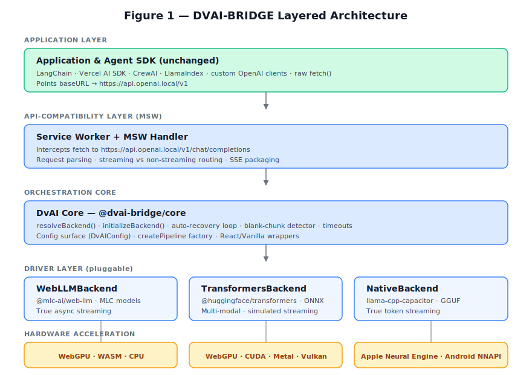
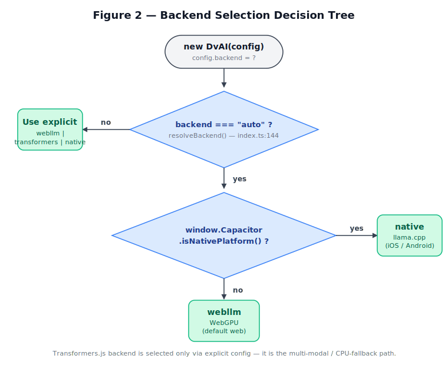
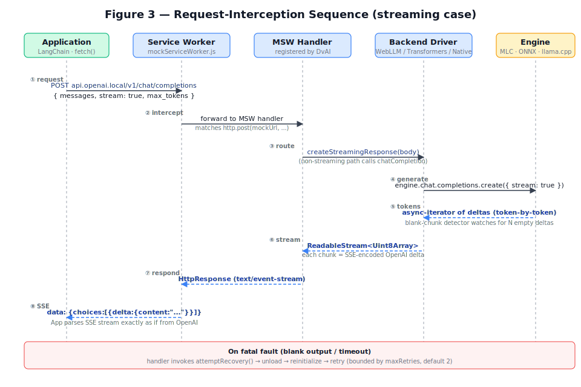
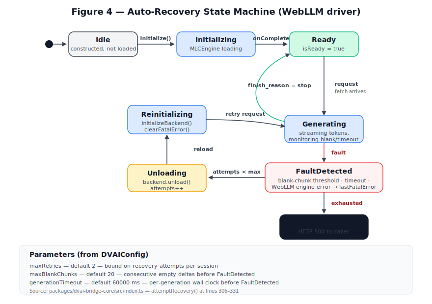
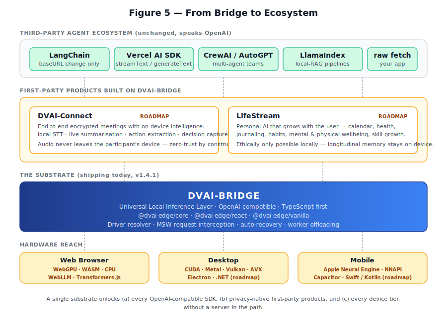

# DVAI-BRIDGE: A Universal Local Inference Layer for Agentic AI on the Client

**Author:** Deep Chakraborty, CTO, Deep Voice AI Limited
**Affiliation:** Deep Voice AI Limited, 71–75 Shelton Street, Covent Garden, London, WC2H 9JQ, United Kingdom
**Correspondence:** Deep Voice AI Limited
**Date:** April 2026
**Keywords:** edge AI, local inference, WebGPU, llama.cpp, OpenAI API, agentic AI, service worker, mock service worker, on-device LLM, privacy-preserving ML

---

## Abstract

The dominant deployment model for large language models (LLMs) today places inference inside centralized cloud services. For agentic workloads — where a single user request fans out into tens or hundreds of model calls — this architecture creates compounding problems across privacy, cost, latency, and vendor lock-in. We present **DVAI-BRIDGE**, a TypeScript library (packages: `@dvai-bridge/core`, `@dvai-bridge/react`, `@dvai-bridge/vanilla`) that moves inference to the end-user's device and presents the result as a drop-in replacement for the OpenAI HTTP API. The library achieves this by (i) defining a pluggable *driver* abstraction over three industry-standard inference engines — WebLLM (WebGPU), Transformers.js (ONNX), and llama.cpp (native mobile) — and (ii) installing a Mock Service Worker (MSW) interceptor in the browser so that any HTTP client pointed at `https://api.openai.local/v1/chat/completions` transparently hits the local model instead of the public internet. Because the wire format is unchanged, existing agent SDKs such as LangChain, Vercel AI SDK, CrewAI, and LlamaIndex work against DVAI-BRIDGE without code changes. We describe the architecture, the interception mechanism, the auto-recovery state machine that stabilises browser WebGPU failures, and three integration case studies. We then honestly delimit what the library is and is not today, before situating it inside a broader thesis: edge AI is becoming a *peer tier* to cloud AI, and purpose-built on-device applications such as *DVAI-Connect* (end-to-end-encrypted meetings with local intelligence) and *LifeStream* (a longitudinal personal assistant) are only ethically deployable when inference is local.

---

## 1. Introduction

The conventional wisdom for shipping LLM features in 2024–2026 has been "call the cloud." This works well for isolated, stateless prompts, but it frays quickly under three pressures that define agentic enterprise AI:

1. **Privacy and compliance.** Agent workflows tend to pull in the most sensitive context available — user files, meeting transcripts, patient records, internal code. Shipping that context to a third-party endpoint materially expands the data-protection surface that a CISO has to defend. Regulations such as the EU General Data Protection Regulation (GDPR), the Health Insurance Portability and Accountability Act (HIPAA), and the EU AI Act explicitly favour data minimisation and on-device processing where feasible.
2. **Cost.** A single user goal in an agent system typically expands into a tree of model calls (plan, tool-select, observe, reflect, retry, summarise). Each interior node is a billable token round-trip. The economics that make cloud LLMs attractive for a chat UI invert when a bot can spend ten dollars per successful task.
3. **Latency and reliability.** Agent loops are latency-multiplicative: every cloud round-trip is paid N times. Cloud outages compound the same way.

Two further pressures are under-discussed:

4. **Vendor lock-in.** Building on a proprietary API creates a hard dependency on a single vendor's roadmap, pricing, and content policy.
5. **Model over-specification.** A 175B+ generalist model is expensive overkill for narrow enterprise tasks that a 1B–3B specialist can solve. The right architecture is a *pipeline of small specialists*, not a monolithic oracle.

At the same time, three tailwinds now make client-side inference feasible in a way it was not two years ago. **Hardware:** WebGPU has shipped in every major browser; Apple Neural Engine, Qualcomm Hexagon, Intel NPU, and AMD XDNA appear in virtually every new consumer device. **Models:** small specialists such as Llama 3.2 1B, Gemma 2B, and Phi-3-mini approach the 2023-era quality of GPT-3.5 while fitting comfortably in 1–3 GB of VRAM after 4-bit quantisation. **Tooling:** WebLLM, Transformers.js, and llama.cpp now each expose production-grade on-device inference, but under three different APIs, three different build stories, and three different deployment targets.

The gap, then, is not *inference engines*; the gap is an **orchestration layer** that lets a developer write one piece of code and have it run against a local WebGPU engine in the browser, a CUDA/Metal build in an Electron shell, and a GGUF llama.cpp binary on an iOS or Android device — while preserving compatibility with the agent SDKs the ecosystem has already standardised on.

**DVAI-BRIDGE fills that gap.** Concretely, this paper contributes:

- **C1.** A *pluggable driver architecture* (§3) that unifies three heterogeneous inference engines behind a single TypeScript interface.
- **C2.** An *in-page OpenAI API emulator* built on MSW + the Service Worker API (§4). Because the emulation happens at the HTTP layer, any OpenAI-compatible SDK works unchanged.
- **C3.** A pragmatic *robustness layer* — blank-chunk detection, generation timeouts, and a bounded automatic unload-and-reload recovery loop (§5).
- **C4.** A *custom-pipeline factory* (`createPipeline`) that keeps the library small while extending it to arbitrary Transformers.js-compatible model families.
- **C5.** A *forward vision* (§8) for how this substrate unlocks privacy-native applications — DVAI-Connect and LifeStream — that are ethically unviable under cloud inference.

The rest of the paper is organised as follows. §2 reviews related systems. §3 describes the architecture. §4 is the central technical contribution: the MSW-based OpenAI-compatibility layer. §5 covers streaming and robustness. §6 reports integration case studies and honestly disclaims what is not yet benchmarked. §7 discusses trade-offs. §8 projects the roadmap. §9 enumerates limitations. §10 concludes.

---

## 2. Background and Related Work

**Server-local inference.** Ollama, LM Studio, vLLM, and standalone llama.cpp deployments all let a user run an LLM on their own hardware. These systems work well for developers but are impractical for end-user distribution: they require the end user (or an IT department) to install a server, bind a port, manage firewalls, and update the model zoo. In a consumer app — say, a browser-based product — asking the user to install a background server is a distribution-killer.

**Browser-local inference.** MLC's *WebLLM* [WebLLM] compiles models through MLIR/TVM to WebGPU and ships them as WebAssembly, delivering state-of-the-art performance inside a tab. Hugging Face's *Transformers.js* [TJS] wraps the ONNX Runtime Web and exposes a Python-style `pipeline()` API across an enormous catalogue of ONNX-quantised models, including vision and audio. *ONNX Runtime Web* [ORT] underlies Transformers.js but is lower-level. Each of these is excellent at its layer but exposes its own idiosyncratic API, and none of them speaks OpenAI.

**Mobile-local inference.** `llama.cpp` [LlamaCpp] has become the de-facto portable C++ runtime for GGUF-format quantised models, with community-maintained iOS (Metal) and Android (Vulkan) bindings. Apple's Core ML and Google's MediaPipe LLM Inference are the platform-native alternatives; MLC-LLM's mobile runtime is another option.

**Cloud APIs as the *de-facto* agent interface.** OpenAI's Chat Completions API has become a *lingua franca*: LangChain [LC], Vercel AI SDK, CrewAI, LlamaIndex, and a long tail of agent libraries either default to it or offer it as a first-class backend. OpenAI-compatibility has in effect become a standard — one that competing vendors (Together, Groq, Anyscale, DeepInfra, Mistral, Fireworks) deliberately implement.

**The gap we identify.** No existing system combines (a) true client-side inference that spans Web + Desktop + Mobile, (b) OpenAI-wire-compatibility at the HTTP layer, and (c) a *zero-setup* distribution story — i.e., no install step for the end user beyond opening the app. DVAI-BRIDGE is aimed precisely at this intersection.

---

## 3. System Architecture



### 3.1 Design Goals

DVAI-BRIDGE was written against five concrete goals:

- **G1 — Uniform API across environments.** One TypeScript surface that behaves identically in a browser tab, a desktop Electron shell, and a Capacitor-wrapped mobile app.
- **G2 — Zero end-user setup.** The user should not install anything, run a background server, or touch a config file. If the app opens, inference runs.
- **G3 — Ecosystem compatibility.** Any library that already speaks OpenAI should work with DVAI-BRIDGE by changing only a `baseURL`.
- **G4 — Hardware agnosticism.** Pick the fastest available execution path automatically — WebGPU if present, native llama.cpp if inside Capacitor, else WebAssembly CPU.
- **G5 — Extensibility without library churn.** Adding a new model should not require a new library release.

### 3.2 The Pluggable Driver Abstraction

The core package (`@dvai-bridge/core`, ≈1.9 kLOC) exports a single orchestrator, `DvAI`, which delegates to one of three drivers at runtime (files in `packages/dvai-bridge-core/src/`):

| Driver | Engine | Model format | Streaming | Target |
|---|---|---|---|---|
| `WebLLMBackend` | `@mlc-ai/web-llm` | MLC-compiled (WebGPU) | **True** async-iterator | Browser, WebGPU-capable |
| `TransformersBackend` | `@huggingface/transformers` | ONNX (Transformers.js v4.0.1+) | **True** token-level via `TextStreamer` | Browser (WebGPU/WASM), Node.js |
| `NativeBackend` | `llama-cpp-capacitor` | GGUF | **True** token callback | Capacitor iOS/Android |

Each driver implements the same four-method contract: `initialize(onProgress)`, `chatCompletion(body)`, `createStreamingResponse(body)` → `ReadableStream<Uint8Array>`, and `unload()`. The `DvAI` class does not know or care which driver is active; it only knows how to plug a driver into the OpenAI-shaped request/response surface described in §4.

### 3.3 Environment Detection and Auto-Selection



The configuration surface (`DvAIConfig`) accepts `backend: "webllm" | "transformers" | "native" | "auto"`. When `auto` is chosen, `DvAI.resolveBackend()` (in `packages/dvai-bridge-core/src/index.ts`) performs a two-step decision:

```typescript
private resolveBackend(): "webllm" | "transformers" | "native" {
  if (this.backend === "auto") {
    const isCapacitor =
      typeof window !== "undefined" &&
      !!(window as any).Capacitor?.isNativePlatform?.();
    if (isCapacitor) return "native";
    return "webllm";
  }
  return this.backend as "webllm" | "transformers" | "native";
}
```

That is: if the runtime is a Capacitor-wrapped mobile app, prefer the native GGUF/llama.cpp path; otherwise default to WebLLM. The Transformers.js backend is never chosen by `auto` — it is the *opt-in* path for multi-modal workloads (image-to-text, ASR, TTS, feature extraction) or for CPU-only fallback.

### 3.4 Configuration and Extensibility

The `DvAIConfig` surface is intentionally small. The main knobs fall into four groups:

- **Backend selection**: `backend`, `modelId`, `transformersModelId`, `pipelineTask`, `device`, `dtype`.
- **Native (Capacitor)**: `nativeModelPath`, `nativeGpuLayers` (default 99), `nativeThreads` (default 4), `nativeContextSize` (default 2048), `nativeEmbeddingMode` (default `false`; set `true` to specialise the llama.cpp context for embeddings).
- **Robustness**: `generationTimeout` (default 60 000 ms), `maxBlankChunks` (default 20), `maxRetries` (default 2).
- **Transport**: `mockUrl` (default `https://api.openai.local/v1/chat/completions`, also used to derive the base URL for `/v1/completions`, `/v1/embeddings`, and `/v1/models`), `serviceWorkerUrl`, per-backend worker URLs.

The extensibility story is carried by `createPipeline`, a factory callback that lets a caller bring any Transformers.js-compatible model — including architectures the library has never heard of (e.g., `Gemma4ForConditionalGeneration` with a custom `AutoProcessor`). DvAI supplies MSW wiring, streaming serialisation, and OpenAI shaping; the caller supplies model loading and the `generate` function. This avoids the anti-pattern in which every new model requires a new library release.

### 3.5 React and Vanilla Wrappers

Two thin wrappers exist on top of the core:

- **`@dvai-bridge/react`** ships a `DvAIProvider` context component and a `useDvAI()` hook that exposes `{ isReady, progress, mockUrl, backend, modelId, init, unload, dvai }`.
- **`@dvai-bridge/vanilla`** wraps the core with a `subscribe(listener)` observable pattern for frameworks (Vue, Svelte, Angular) or vanilla apps.

Both are thin — the core does the work, the wrappers translate state transitions into idioms the framework likes.

---

## 4. The OpenAI-Compatibility Layer

This is the library's central contribution, and the mechanism that turns every other architectural decision from "neat" into "useful."



### 4.1 Why OpenAI-Compatibility Matters

Agent SDKs are opinionated about wire format. LangChain's `ChatOpenAI`, Vercel AI SDK's `streamText`, CrewAI's tool loops, and most of the long tail of "build an agent" libraries assume an OpenAI-shaped HTTP endpoint serving `/v1/chat/completions` with SSE streaming. Any local-inference library that wants to be *used* — rather than ported to, one SDK at a time — has to either (a) fork every SDK or (b) serve the agreed wire format. DVAI-BRIDGE chooses (b).

### 4.2 In-Page HTTP Interception via MSW

Mock Service Worker (MSW) [MSW] is a library originally built for API mocking in tests. It registers a real browser Service Worker that intercepts `fetch` calls matching a route pattern and hands them to a user-defined handler. DVAI-BRIDGE repurposes this mechanism for production: during `DvAI.initialize()`, the library registers a handler for its mock URL (default `https://api.openai.local/v1/chat/completions`) and then calls `setupWorker(...).start({ serviceWorker: { url: "/mockServiceWorker.js" }, onUnhandledRequest: "bypass" })`.

The handler (excerpt from `DvAI.buildMswHandlers()` in `packages/dvai-bridge-core/src/index.ts`; one of four handlers, covering `POST /v1/chat/completions`) is terse but does a surprising amount:

```typescript
http.post(this.mockUrl, async ({ request }) => {
  const requestBody = await request.json();
  if (requestBody.stream) {
    const stream = this.backendInstance.createStreamingResponse(requestBody);
    return new HttpResponse(stream, {
      headers: {
        "Content-Type": "text/event-stream",
        "Cache-Control": "no-cache",
        Connection: "keep-alive",
      },
    });
  }
  const response = await this.backendInstance.chatCompletion(requestBody);
  return HttpResponse.json(response);
});
```

Four things are worth noting:

1. **The handler is environment-agnostic.** Whether the active driver is WebLLM, Transformers.js, or Native, the handler's code is unchanged — the driver polymorphism is absorbed by `this.backendInstance`.
2. **The response honours the SSE contract.** Streaming responses carry the standard `text/event-stream` content type, which means the client's SSE parser (from LangChain, the AI SDK, or a hand-written `EventSource`) works verbatim.
3. **Non-browser paths are handled gracefully.** If the code is running inside a Web Worker or if `serviceWorkerUrl` is explicitly empty, MSW setup is skipped and callers are expected to invoke `chatCompletion()`/`createStreamingResponse()` directly on the `DvAI` instance.
4. **The mock URL is itself a configuration knob.** An app can expose its local inference endpoint at any host name, not just `api.openai.local`, and re-point its SDKs accordingly.

### 4.3 Implications

Because the interception happens at the HTTP layer rather than inside a JavaScript binding, the library achieves a rare property: **ecosystem leverage without ecosystem wrapping**. Consider the LangChain case (from the project's reference docs):

```typescript
import { ChatOpenAI } from "@langchain/openai";

const chat = new ChatOpenAI({
  apiKey: "not-needed",
  configuration: { baseURL: "https://api.openai.local/v1" },
});
const reply = await chat.invoke([{ role: "user", content: "Hello!" }]);
```

This is not a DVAI-BRIDGE-specific LangChain adapter. It is *the* LangChain OpenAI client, unchanged, pointed at the mocked endpoint. Every LangChain feature that works against OpenAI today — streaming, tool calling via downstream SDK logic, structured output, runnable graphs — works against DVAI-BRIDGE too, for free.

### 4.4 What Is and Is Not Implemented Today

The library currently implements four OpenAI endpoints, all registered through the same MSW interceptor and derived from a single `mockUrl`:

- `POST /v1/chat/completions` — the primary endpoint; streaming and non-streaming supported on all three drivers.
- `POST /v1/completions` — the legacy OpenAI text-completion endpoint. The incoming `prompt` is wrapped as a single user message, forwarded to the chat pipeline, and the response is rewritten to the legacy `text_completion` shape. A small SSE adapter rewrites chat chunks to the legacy chunk shape for streaming clients.
- `POST /v1/embeddings` — returns OpenAI-shaped embedding vectors. Gated by backend: supported when `backend: "transformers"` with `pipelineTask: "feature-extraction"`, or when `backend: "native"` with `nativeEmbeddingMode: true`. WebLLM returns HTTP 400 with an explanatory error since MLC runtimes do not currently expose embedding outputs.
- `GET /v1/models` — returns a single-entry list with the currently loaded model ID, matching the OpenAI `list models` response shape.

The remaining OpenAI surface — `/v1/audio/*` and `/v1/images/*` — is explicitly **future work**. These are the two endpoint families that require additional pipeline machinery (ASR/TTS models, image-generation models) that the library does not yet orchestrate through its OpenAI layer; users can, however, reach them today via `DvAI.runPipeline()` on the Transformers.js backend. The roadmap in §8 returns to this.

---

## 5. Streaming and Robustness

### 5.1 Streaming Across Backends

All three drivers expose `createStreamingResponse(body): ReadableStream<Uint8Array>` and serialise to the OpenAI delta-chunk SSE format. Under the hood they differ in mechanism but are now uniformly *true streaming*:

- **`WebLLMBackend`** receives a native async iterator of `ChatCompletionChunk` objects from MLC, wraps it in a `ReadableStream`, and emits each chunk verbatim. Tokens are forwarded as soon as the engine produces them.
- **`NativeBackend`** uses the `llama-cpp-capacitor` per-token callback to push tokens into the stream as they are decoded by llama.cpp.
- **`TransformersBackend`** attaches a `TextStreamer` (from `@huggingface/transformers`) to the underlying pipeline with `skip_prompt: true` and a `callback_function` that forwards each decoded text fragment. In worker mode the callback runs inside the Web Worker and `postMessage`s a `stream_chunk` event per fragment; in main-thread mode it enqueues directly. An earlier implementation generated the full response and then split it on whitespace to *simulate* streaming — that path has been removed because its time-to-first-token equalled full generation time, defeating the UX purpose of streaming.

With this change, perceived-latency characteristics are now roughly comparable across the three drivers; differences that remain are properties of the underlying engines (WebGPU vs. ONNX Runtime vs. Metal/Vulkan llama.cpp) rather than of DVAI-BRIDGE itself.

### 5.2 Failure Modes in Practice

WebGPU inference in a browser is not mission-critical-software yet. In several months of production use, three fault classes recurred:

- **Blank-output deadlock.** The engine nominally produces tokens, but every delta's `content` field is empty. The stream would never end on its own.
- **Runaway / stuck generation.** The engine produces tokens but never hits a stop sequence, or hangs on a single shader dispatch.
- **Silent engine failure.** The underlying WebGPU adapter is lost (device unplugged, driver crash, tab backgrounded aggressively) and the engine enters an unrecoverable state.

### 5.3 The Auto-Recovery State Machine



DVAI-BRIDGE addresses all three classes with a single bounded state machine (`DvAI.attemptRecovery()` in `packages/dvai-bridge-core/src/index.ts`):

- A *blank-chunk counter* is incremented each time the driver emits a chunk with empty `delta.content`; if it exceeds `maxBlankChunks` (default 20), the driver marks `lastFatalError` and aborts.
- A *generation timeout* (default 60 000 ms) races every streamed iteration; timing out likewise marks `lastFatalError`.
- Any driver error during `createStreamingResponse` or `chatCompletion` raises to the MSW handler.

When the handler detects a fatal error *and* `recoveryAttempts < maxRetries` (default 2), it executes:

1. `backend.unload()` — release the engine and GPU resources.
2. `initializeBackend()` — rebuild the driver from scratch.
3. `backend.clearFatalError()` — reset the blank-chunk counter.
4. Replay the user's original request on the fresh engine.

If `recoveryAttempts` is exhausted, the handler returns an HTTP 500 to the caller. The state machine therefore caps the *worst-case* behaviour at `maxRetries + 1` attempts per user request, and there is no unbounded loop. In practice, the single-attempt recovery path clears the vast majority of WebGPU-driver transients.

---

## 6. Evaluation and Case Studies

No published performance benchmarks currently exist for DVAI-BRIDGE. Rather than fabricate numbers, we present qualitative evaluation along three axes — *ecosystem reach*, *extensibility*, and *deployability* — and then openly disclose what remains to be measured.

### 6.1 Case Study: LangChain Agent Over a Local Model

The essential developer ergonomics claim is that migrating an existing OpenAI-backed agent to DVAI-BRIDGE is a one-line change. Consider a typical LangChain tool-using agent. The *before* code targets OpenAI:

```typescript
const chat = new ChatOpenAI({ apiKey: process.env.OPENAI_API_KEY });
```

The *after* code targets DVAI-BRIDGE:

```typescript
const chat = new ChatOpenAI({
  apiKey: "not-needed",
  configuration: { baseURL: "https://api.openai.local/v1" },
});
```

The rest of the agent's graph — tool definitions, prompt templates, runnables, output parsers — is untouched. For small local models, the project's reference documentation recommends a manual JSON-parsing loop on the assistant content rather than the cloud-grade function-calling protocol, because models in the 1–3B range emit tool calls as inline JSON rather than as structured `tool_calls` fields. This is an honest constraint of small-model behaviour, not a library limitation.

### 6.2 Case Study: Custom Pipeline for Gemma 4 Multimodal

Not every Transformers.js-compatible model fits the stock `pipeline()` API — vision-language models in particular often require an `AutoProcessor`, manual input packing, and a non-standard `generate` signature. The `createPipeline` factory lets users bring the full machinery without forking the library:

```typescript
const createGemma4: CreatePipelineFn = async (transformers, ctx) => {
  const { AutoProcessor, Gemma4ForConditionalGeneration } = transformers;
  const processor = await AutoProcessor.from_pretrained(ctx.modelId, {
    progress_callback: ctx.onProgress,
  });
  const model = await Gemma4ForConditionalGeneration.from_pretrained(ctx.modelId, {
    dtype: ctx.dtype, device: ctx.device,
  });
  return async (messages, options) => {
    const prompt = processor.apply_chat_template(messages, {
      add_generation_prompt: true,
    });
    const inputs = await processor(prompt, null, null, { add_special_tokens: false });
    const outputs = await model.generate({
      ...inputs,
      max_new_tokens: options?.max_new_tokens ?? 512,
    });
    const decoded = processor.batch_decode(
      outputs.slice(null, [inputs.input_ids.dims.at(-1), null]),
      { skip_special_tokens: true },
    );
    return [{ generated_text: decoded[0] ?? "" }];
  };
};
```

Passing `createPipeline: createGemma4` to the config slots the custom loader into the driver. MSW wiring, streaming, and OpenAI shaping are still supplied by DvAI. This pattern has scaled to multimodal families that did not exist when the library was written — a meaningful test of the extensibility goal (G5).

### 6.3 Case Study: Mobile GGUF via Capacitor

On a Capacitor-wrapped iOS or Android app, a single config switches from browser inference to on-device GGUF via `llama-cpp-capacitor`:

```typescript
<DvAIProvider config={{
  backend: "auto",                                    // Capacitor detected → native
  nativeModelPath: "public/models/mistral-7b-Q4_K_M.gguf",
  nativeGpuLayers: 99,
  nativeThreads: 4,
  nativeContextSize: 2048,
}}>
  <MyChat />
</DvAIProvider>
```

The `MyChat` component does not know whether it is being served by WebLLM in Safari or by llama.cpp through Metal on an iPhone. The OpenAI-compatibility layer erases the difference from the application's point of view.

### 6.4 Developer-Ergonomics Diff

A cloud-to-local migration in this architecture involves three touched surfaces: one `baseURL` change, one `api-key` change, and one `<DvAIProvider>` wrap. No tool calls are rewritten. No agent graphs are rebuilt. No streaming parser is re-plumbed. The minimal-friction promise (G3) is kept on the development side.

### 6.5 What Remains Unmeasured

Honest disclosure: the current codebase and documentation carry **no published benchmarks**. Specifically absent are:

- **Latency.** Time-to-first-token and tokens-per-second for each driver × model × device class combination.
- **Throughput under load.** Behaviour under concurrent agent calls in the same tab.
- **Memory footprint.** Peak VRAM and RSS across model sizes and quantisations.
- **Power and thermals.** Mobile-device sustained inference battery cost and thermal throttling curves.
- **Quality-at-quantisation.** Task-level quality drop from q8 → q6 → q4 → q3 for each driver's supported quantisation set.
- **Comparative studies** against Ollama (server-local), WebLLM-standalone, and direct OpenAI calls.

We regard closing this gap as the most important near-term research task. A proposed methodology: fix a small test suite (e.g., MT-Bench subset, a tool-calling suite, and three retrieval-grounded QA sets) and run it end-to-end through each driver on three reference devices (a WebGPU-capable laptop, an Electron desktop with dGPU, and a current-generation iPhone/Android), reporting latency percentiles, tokens per second, and task accuracy.

---

## 7. Discussion: Scope, Trade-offs, Honest Positioning

It is worth stating, sharply, what DVAI-BRIDGE is and is not.

**What it is:** a *client-side inference and API-compatibility layer* — a substrate that makes a local model answer to the OpenAI wire protocol on the device that owns the data.

**What it is not:** an in-library agent runtime. DVAI-BRIDGE does not ship an agent loop, a tool-call scheduler, a memory store, a retrieval index, or a planner. It does not define an "Agent" class. It implements a deliberately narrow slice of the OpenAI HTTP surface (`/v1/chat/completions`, `/v1/completions`, `/v1/embeddings`, `/v1/models`) and stops there.

This is a *deliberate* architectural choice, not an omission. The design bet is that the agent ecosystem will converge on the OpenAI HTTP interface (as it has), and that *betting on the interface rather than on a specific runtime* is the higher-leverage move. Every month, LangChain, Vercel, CrewAI, LlamaIndex, and their peers improve their agent loops. DVAI-BRIDGE inherits every one of those improvements at zero engineering cost because the interface is unchanged. If the library tried to own the agent loop itself, it would spend most of its engineering budget racing the ecosystem it depends on.

Three further trade-offs worth naming:

- **MSW is a clever transport, not a universal one.** Service Workers require an HTTPS (or localhost) origin, are blocked in some cross-origin iframes, and are not available in pure Node.js or Deno server contexts. For those contexts DVAI-BRIDGE exposes `dvai.chatCompletion()` and `dvai.createStreamingResponse()` directly, bypassing the mock layer.
- **`createPipeline` flexibility comes at the cost of a larger built-in model zoo.** The library keeps itself small and defers exotic model loaders to the caller. For most callers this is the right trade; for callers who want a shrink-wrapped experience it is friction.
- **OpenAI surface is partial.** `/v1/chat/completions`, `/v1/completions`, `/v1/embeddings`, and `/v1/models` are implemented today; `/v1/audio/*` and `/v1/images/*` are not. Embeddings now unblock fully-local RAG (with the backend caveats in §4.4), but audio and image endpoints remain prioritised future work.

The deeper point is that the library's moat is not any single backend — Transformers.js and WebLLM are both excellent, but neither is proprietary. The moat is the **OpenAI-mock-as-universal-interface** pattern. That is what turns three heterogeneous runtimes into one product.

---

## 8. Forward Vision: From Bridge to Ecosystem



DVAI-BRIDGE, as shipped, is a substrate. Interesting substrates invite applications — especially applications that were previously blocked by the cloud assumption.

### 8.1 Roadmap for the Library Itself

- **Expanded API surface.** `/v1/embeddings`, `/v1/completions`, and `/v1/models` have shipped. Remaining work: `/v1/audio/transcriptions` (unblocks privacy-native voice workflows) and `/v1/images` (unblocks local vision generation).
- **Native Framework Support.** Dedicated drivers for .NET-based enterprise applications.
- **Native mobile bindings.** First-class iOS (Swift) and Android (Kotlin) SDKs that expose the DvAI contract without requiring Capacitor.
- **React Native bridge.** Bringing the local-inference layer directly into RN's native bridge so mobile UIs get native-speed streaming.
- **Flutter / Dart bindings.** Parity with the TypeScript surface for the Flutter ecosystem.
- **Cryptographic licence validation.** The current `LicenseValidator` is a placeholder; a signed-token design is planned for commercial deployments.
- **Published benchmarks** (per §6.5).

### 8.2 DVAI-Connect: E2EE Meetings with On-Device Intelligence

The first-party flagship application we are building on DVAI-BRIDGE is **DVAI-Connect**: an end-to-end-encrypted real-time meeting platform with local intelligence. In the DVAI-Connect model:

- Audio never leaves the participant's device. Speech-to-text runs inside each browser tab / Electron window via DVAI-BRIDGE's ONNX Whisper pipeline.
- Live summarisation, action-item extraction, and decision capture run against a local small model through DVAI-BRIDGE's `/v1/chat/completions` endpoint.
- Only the **encrypted transcript and the locally-derived artefacts** traverse the network, bound to a Signal-style group-key ratchet so that the meeting server itself sees nothing but ciphertext.

The contrast with current cloud-transcription offerings (Otter, Zoom AI Companion, Fireflies) is structural: those services require the meeting audio, in cleartext, inside the vendor's infrastructure. For regulated domains — legal, healthcare, financial services, M&A — that is a non-starter. DVAI-Connect is only possible *because* the inference layer is local.

### 8.3 LifeStream: A Personal AI that Grows With the User

The second application, **LifeStream**, is at the opposite end of the sensitivity spectrum: a personal AI that learns from the user's daily life and helps them manage it. In the LifeStream model:

- The AI has longitudinal memory of the user — calendar, journaling, health signals (sleep, heart rate, activity), habits, goals, relationships.
- It coaches across dimensions that are traditionally siloed: time management, physical training, mental wellbeing, skill growth, relationship maintenance.
- The memory is *exclusively* on-device. It is encrypted at rest, keyed to the user's hardware secure enclave, and never synchronised to a server in cleartext.

The ethical argument is the key one: a cloud-hosted version of LifeStream would be the most intimate dataset ever compiled on an individual. That kind of product is not *shippable* under any reasonable privacy regime. It becomes deployable only when the inference (and therefore the memory it consults) is local — which is exactly what DVAI-BRIDGE provides.

### 8.4 The Broader Edge-AI Horizon

DVAI-BRIDGE, DVAI-Connect, and LifeStream are three points on a larger trajectory. The industry-wide forces pushing inference onto the device include:

- **Hardware.** Every new laptop class now ships with a dedicated NPU — Apple Neural Engine, Qualcomm Hexagon, Intel NPU, AMD XDNA, Microsoft's Copilot+ silicon. Mobile SoCs have crossed 40 TOPS. WebGPU stable is available in every major browser. The *hardware* for local AI has quietly gone from optional to ambient.
- **Models.** The small-specialist frontier has moved decisively. Llama 3.2 1B, Gemma 2B, Phi-3-mini, and their peers reach 2023-era GPT-3.5 quality on a wide range of tasks at a fraction of the compute. Post-training quantisation from q8 down to q3 preserves most of that quality while fitting in commodity RAM.
- **Regulation.** GDPR, HIPAA, the EU AI Act, Brazil's LGPD, and comparable regimes in Asia all explicitly favour data minimisation and on-device processing. For regulated data, cloud inference is no longer the default; it is the *exception that has to be justified*.
- **Economics.** Per-token cloud pricing makes agent workflows fundamentally non-free. Every attempt to productise agent loops at scale eventually hits a pricing wall. Moving the work to the user's already-bought silicon resets the economics.

Taken together, these forces support a thesis we will commit to here: **local-first AI will become a peer tier of cloud AI, not a fallback.** Some workloads — planet-scale search, frontier-model training, workloads that require the most capable single model on earth — will stay in the cloud. But a growing class of workloads — personal assistants, regulated enterprise agents, real-time voice, privacy-sensitive knowledge work — will move to the device. DVAI-BRIDGE is our bet on the substrate that enables that migration.

---

## 9. Limitations

We list the library's real limitations candidly, so that readers and adopters can plan around them.

- **Partial OpenAI surface.** `/v1/chat/completions`, `/v1/completions`, `/v1/embeddings`, and `/v1/models` are implemented; `/v1/audio/*` and `/v1/images/*` are not.
- **Embeddings are backend-gated.** `/v1/embeddings` requires either `backend: "transformers"` with `pipelineTask: "feature-extraction"` or `backend: "native"` with `nativeEmbeddingMode: true`. WebLLM returns HTTP 400 for embedding requests because MLC runtimes do not expose embedding outputs today.
- **Native chat and native embeddings are separate contexts.** llama.cpp specialises a context at creation time — a chat-mode context cannot also produce embeddings — so an application that needs both on the native backend must construct two `DvAI` instances pointed at two GGUF files.
- **No built-in tool/function-calling runtime.** The library relies on the tool-calling loops of downstream agent SDKs (LangChain, Vercel AI SDK, CrewAI); for small local models it recommends manual JSON parsing on assistant content rather than the cloud-grade structured-tool-call protocol. This is a deliberate scope decision, not an oversight.
- **MSW constraints.** Service Worker registration requires a secure origin (HTTPS or localhost), is unavailable inside pure Web Workers, and can be blocked in sandboxed iframes. Non-browser Node.js/Deno paths must use the direct API (`dvai.chatCompletion()`, `dvai.embedding()`, `dvai.createStreamingResponse()`).
- **Licence validation is placeholder.** `LicenseValidator.ts` currently contains TODOs; a cryptographic verification design is planned for v2.
- **Test coverage is selective.** Unit tests exercise backend resolution, config defaults, blank-chunk detection, embeddings, and legacy-completion stream conversion (35 tests across five files); there are no end-to-end tests against real models and no Native-backend tests (which require a Capacitor environment).
- **Desktop/Electron path is implicit.** The library works in Electron via the Transformers.js backend but has no Electron-specific guide or packaging recipe in the documentation yet.
- **No model caching layer.** Model weights are fetched from the Hugging Face CDN (Transformers.js) or the MLC catalogue (WebLLM) on first run. Offline-first packaging is the caller's responsibility today.
- **No in-library agent runtime.** By design (§7), but worth restating: tool calling, retrieval, planning, and memory are delegated to external SDKs.

---

## 10. Conclusion

The most interesting thing about DVAI-BRIDGE is not that it runs language models locally — several projects do that — but that it makes local models *speak OpenAI natively*, on the client, across Web, Desktop, and Mobile, through a single TypeScript API. Mock Service Worker, a library originally written for test mocking, turns out to be the right production transport for an in-page API emulator. The pluggable driver architecture lets three heterogeneous inference engines (WebLLM, Transformers.js, llama.cpp) serve the same wire contract. The auto-recovery state machine papers over the practical realities of WebGPU in a browser. And the `createPipeline` factory keeps the library small while extending its reach to arbitrary Transformers.js model families.

The forward vision extends the substrate. DVAI-Connect takes real-time voice intelligence off the cloud meeting server. LifeStream makes a longitudinal personal assistant ethically shippable by keeping every byte of user memory on-device. Both are applications that do not exist today, and cannot exist under cloud inference, but become straightforward under a substrate that treats the user's device as the execution environment.

We see this as the right architectural move for a defined and growing class of AI products — the class for which privacy, cost, latency, and offline capability matter more than raw model size. The cloud will continue to host frontier training and planet-scale workloads. The edge, underwritten by libraries like DVAI-BRIDGE, will host the AI that runs closest to the user's life.

---

## References

- [WebLLM] MLC Team. *WebLLM: A High-Performance In-Browser LLM Inference Engine*. https://github.com/mlc-ai/web-llm
- [TJS] Hugging Face. *Transformers.js: State-of-the-art Machine Learning for the Web*. https://huggingface.co/docs/transformers.js
- [ORT] Microsoft. *ONNX Runtime Web*. https://onnxruntime.ai/docs/tutorials/web/
- [LlamaCpp] Gerganov, G. *llama.cpp — Port of Facebook's LLaMA model in C/C++*. https://github.com/ggerganov/llama.cpp
- [MSW] Kettanurak, A. et al. *Mock Service Worker — API Mocking of the Next Generation*. https://mswjs.io
- [LC] LangChain, Inc. *LangChain — Building applications with LLMs through composability*. https://www.langchain.com
- [Llama3] Meta AI. *The Llama 3 Herd of Models*. 2024. https://ai.meta.com/research/publications/the-llama-3-herd-of-models/
- [Gemma] Google DeepMind. *Gemma 2: Improving Open Language Models at a Practical Size*. 2024. https://blog.google/technology/developers/google-gemma-2/
- [Phi3] Microsoft Research. *Phi-3 Technical Report*. 2024. https://arxiv.org/abs/2404.14219
- [GDPR] European Parliament and Council. *Regulation (EU) 2016/679*, General Data Protection Regulation.
- [HIPAA] U.S. Department of Health and Human Services. *Health Insurance Portability and Accountability Act of 1996*.
- [EUAIAct] European Parliament and Council. *Regulation (EU) 2024/1689 on Artificial Intelligence*.
- [Capacitor] Ionic. *Capacitor — Cross-platform native runtime for web apps*. https://capacitorjs.com
- [WebGPU] W3C. *WebGPU — Working Draft*. https://www.w3.org/TR/webgpu/

---

*© 2026 Deep Voice AI Limited. Licensed to the public under the terms accompanying the DVAI-BRIDGE distribution.*
